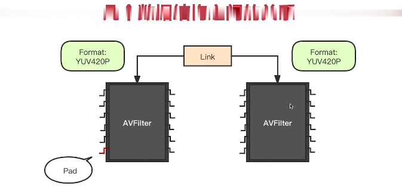

## 创建步骤
- 找到libavfilter目录
- 找到现成的filter模板
- 修改文件名，替换filter name
- 修改makefile,加入【新的filter.o】
- 修改allfilters.c，加入新的filter,重新编译

## 重要的结构体

- AVFilter,对于AVFilter，输入是source,输出是sink
- AVFilterPad:AVFilter的引脚，输入/输出引脚,输入=src pad,输出=sink pad
- AVFilterLink：用于连接filter
- AVFilterFormats: AVFilterPad的 所有格式，视频格式/音频音频,输入是sink,输出是source


```C
typedef struct AVFilter {

    const char *name;
    const char *description;

    //所有输入引脚,src pad
    const AVFilterPad *inputs;
    //所有输出引脚,sink pad
    const AVFilterPad *outputs;
    //初始化AVFilterContext的方法
    int (*init)(AVFilterContext *ctx);
    //格式查询方法，用于  相连接filter 格式协商
    int (*query_formats)(AVFilterContext *);
}
```

```C
struct AVFilterPad{
    char *name;
    //音频还是视频
    enumAVMediaType type;
    //pad对link的设置方法
    // sink pad 把参数设置给link
    // source pad 对link的参数合法性，兼容性进行监测
    int(*config_inputs)(AVFilterLink *link);
    //对frame 做滤镜处理
    // 对于link的输入引脚(sink)才会调用这个方法,获取数据
    int (*filter_frame)(AVFilterLink *link,AVFrame * frame);

    int needs_writable;
}
```

```
 ________                ______             _________
|        |              |      |           |        | 
| Filter | (sink)  ->   | Link | --->(src) | Filter |
|________|              |______|           |________| 
```

```C
struct AVFilterLink {
    //输出的端口
    AVFilterContext* src;
    AVFilterPad* srcpad;
    //输入的端口
    AVFilterContext* dst;
    AVFilterPad* dstpad;

    //音频还是视频
    enumAVMediaType type;

    AVFilterFormats* in_formats;
    AVFilterFormats* out_formats;
}
```


```C
struct AVFilterFormats{
    //formats的元素数量
    unsigned nb_formats;
    int *formats;
}
```