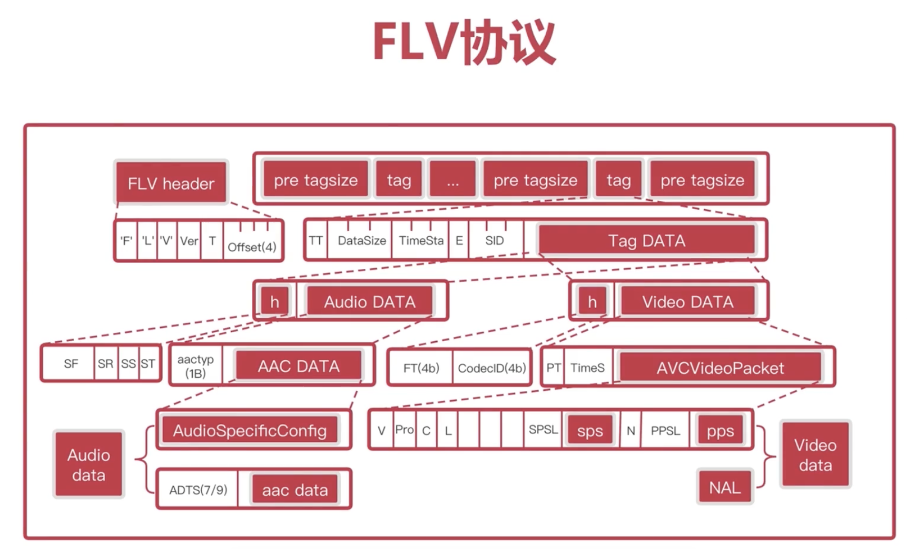

## FLV与RTMP协议的关系

RTMP 的tag data，加上tag header,最前面在加上flv Header就是 FLV文件。

## FLV封装

- FLV Header:9个字节
- 数据； 由多组 (pre tagsize,tag)组成。pre tagsize,表示之前的tag大小，第一个pre tagsize是0.
- Tag:  由 Tag Header与Tag DATA组成。
- Tag Header: TT:音频还是视频。 DataSize表示后面的TagData的大小。SID是流ID.
- Tag Data:保存音频或者视频数据.
- Audio: Header(不重要)+ AudioData
- AudioData: aactype表示是原始数据还是有adts头的数据,AAC DATA是rtmp需要的数据。
- VIDEO：  Header(类型，编码器ID)+ VIDEO DATA
- VIDEO DATA:最重要的是AVCVideoPacket,AVCVideoPacket可是是SPS+PPS 或者NAL

FLV分析器。
Diffinfo