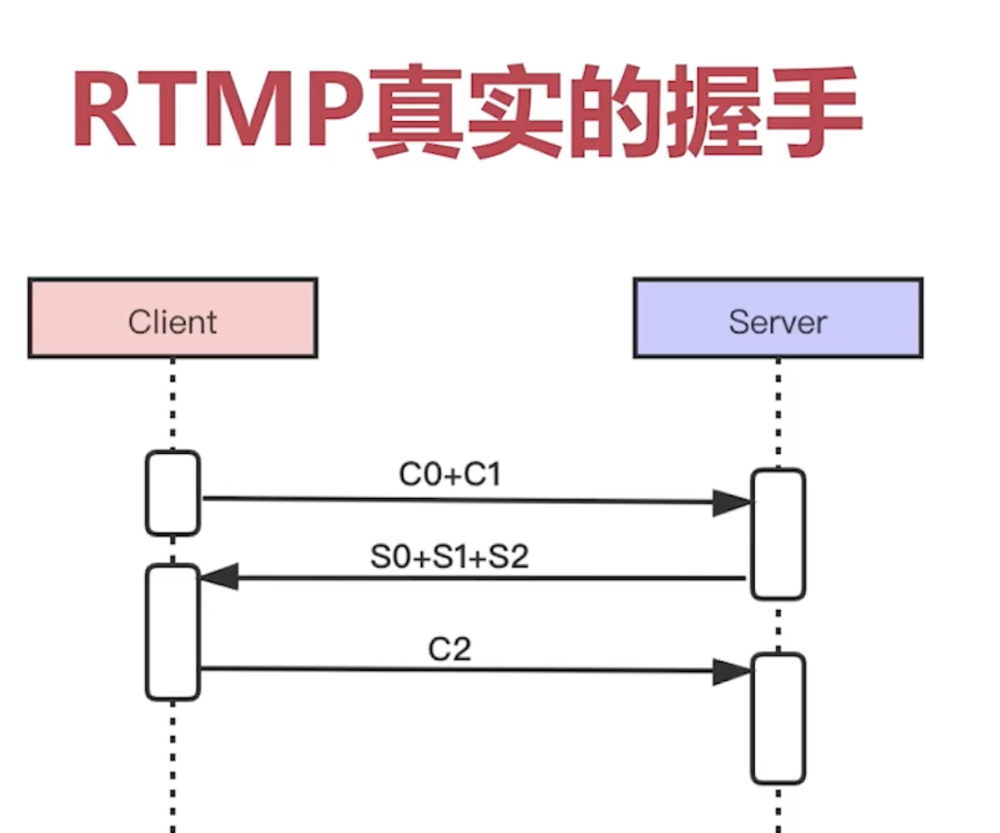
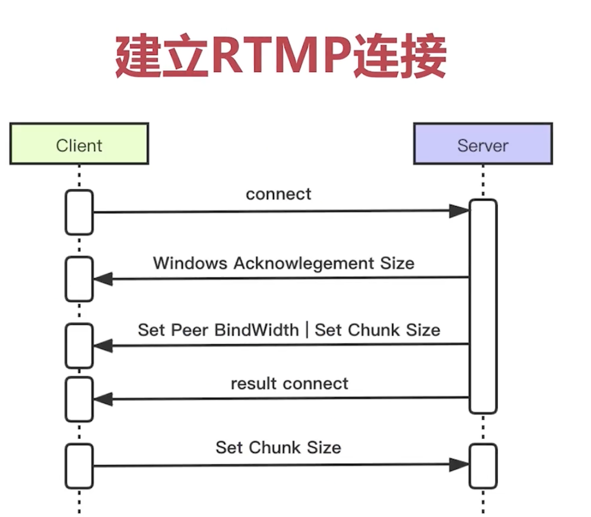
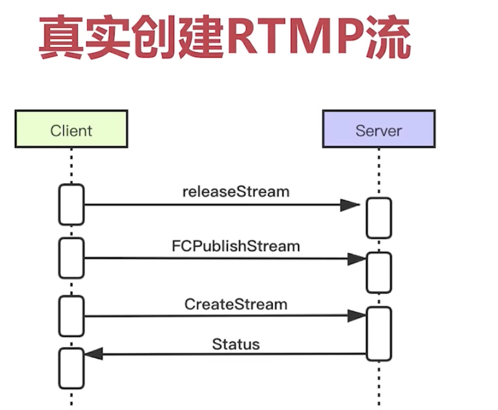
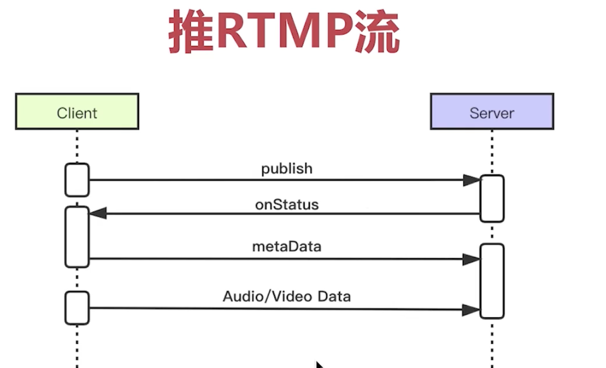
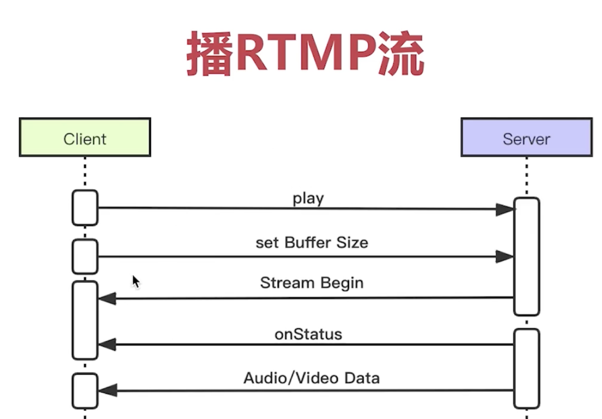
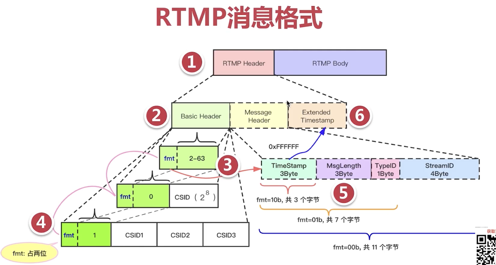
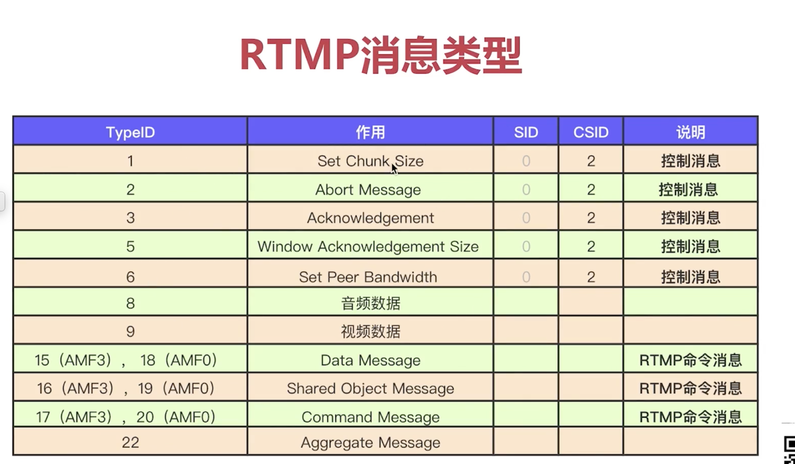

# RTMP协议

直播，点播应用场景。

## 基础概念

- 建立在TCP基础之上,**握手**后建立**RTMP Connection**。
- **RTMP Stream** 在 RTMP CLIENT <--> RTMP SERVER之间传输。

## RTMP创建流的基本流程

1. tcp连接建立
2. RTMP握手
3. 建立RTMP连接
4. 创建RTMP流

### 握手建立的流程图

### RTMP连接建立的流程图

- 客户端主动发起请求
- 服务器要求 设置对端带宽和 要求返回**块大小**
- 客户端返回**块大小**
### RTMP流建立的流程图

- client先考虑释放之前的流
- FCPublishStream没有实际的业务作用，但是为了兼容必须发生
- create stream/on_status的一次交互。
### RTMP推流

- publish/on_status的一次交互。
- metaData是多媒体的 元数据，对于视频是w,h,fps,pix_format,对于音频是sample_rate,channels,sample_size.

### RTMP拉流

## RTMP传输中数据格式

- 1. RTMP消息组成由Header和Body组成
- 2. Header= [Baisc Header]+ [Message Header]+ [Extend Timestamp]三部分组成。其中Baisc是必须与的。
- 3. Baisc Header介绍
- - Baisc Header 头2位是 fmt,fmt决定着[Message Header]的长度与格式。
- - Baisc Header 2-7位的取值决定 Baisc Header的长度
- - CSID(Chuck Stream ID):表示分块后，块的ID，可见之所以 Baisc Header长度会有变化，是和分块有关系的。

| 2-7位的取值| Baisc Header长度|CSID取值范围|CSID偏移|
|-|-|-|-|
|0|4字节|偏移+1字节的表示范围|64|
|1|2字节|偏移+3字节的表示范围|64+256|
|2-63|1字节|6位的表示范围，排除掉0，1，也就是2-63|0|
- 2.2 Message Header介绍
- - Message Header=[TS](3)(3) +[Msg Length](3)(3) +[Msg Type](1)(1) +[StreamID](4)(4)组成
- - Basic Header的fmt决定 Message Header的组成。

| fmt| Msg Header长度|组成|说明|
|-|-|-|-|
|11|0字节|无|所有的都已上一次相同
|10|3字节|Ts|相对于上次，同一流，相同的消息类型，固定的头部长度
|01|7字节|Ts,Msg Len,Msg Type|相对于上次，属于同一个流，所以省略StreamId
|00|11字节|Ts,Msg Len,Msg Type，StreamId|所以信息都发生，如connect('live')
- 4  Extend Timestamp介绍
- - 当 Msg Header中的TS 取值为0XFF FF FF的时候，表示TS长度不够表示时间戳，而使用 Extend Timestamp。

## RTMP传输中消息类型

- TypeID 1-6表示信令消息，主要用于设置server,client直接通信的初始化条件。传输这类消息的时候SID要设置成0，CSID要占2位？？,我的理解是Basic Header的fmt=10。
- TypeID 8-9是实际传输的媒体消息。
- TypeID 10 可以认为传输的是 媒体数据的MetaData.
- AMF 是Adobe定义的数据格式，分配AMF0和AFM3两个版本。 AMF可以理解成=Key Length Value，例如 char 5 [A B C D E], float 3 [1.2 2.3 3.2]