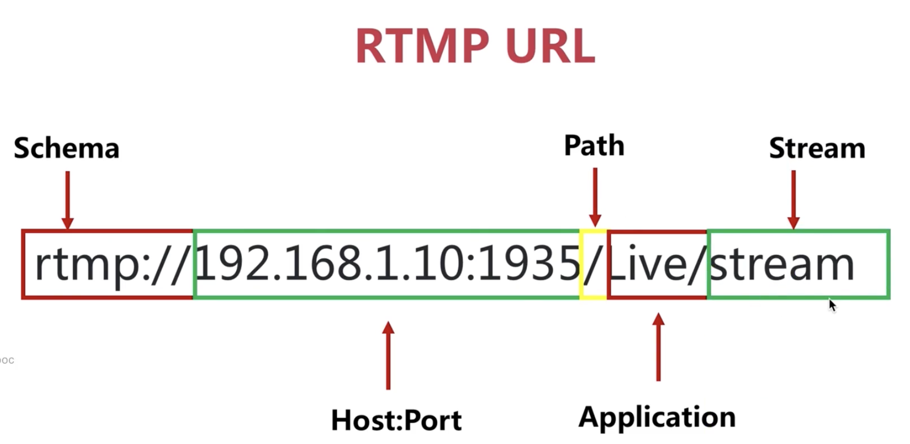

SRS( Simple Rtmp Server)，它是单进程实现的。在同一台服务器上可以起动多个进程同时提供服务。

它的定位是运营级的互联网直播服务器集群 ；它提供了非常丰富的接入方案，支持 RTMP、HLS、HTTP-FLV等。


[文档](https://ossrs.net/lts/zh-cn/docs/v5/doc/getting-started)


## URL

## VHOST
```
vhost cctv1 {
   
}
vhost cctv2 {
   
}
```

[集群部署](https://ossrs.net/lts/zh-cn/docs/v5/doc/sample-rtmp-cluster)
