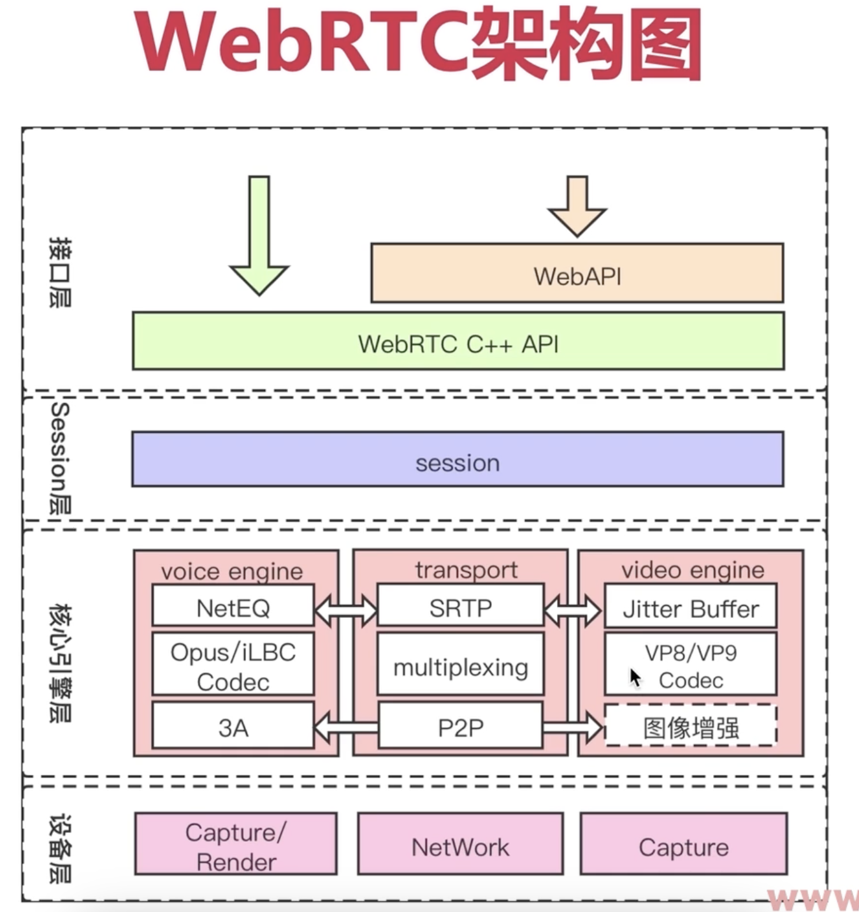

## 本章目录
- 直播的由来
- 直播的技术方向
- 直播技术的重要指标
- webrtc的整体构架

## 直播的由来
- 实时直播互动：WebEx(Zoom 声网)
- 传统直播：CDN技术，Adobe
- WebRTC由何而来:GIPS的独门绝技，被google收购

## 直播的技术方向

||传统直播|实时互动|
|-|-|-|
|目标|一人讲多人看，延时大||
|时延|>3s|<500ms|
|协议|TCP/RTMP/HLS|UDP/RTP/RTCP|
|开源库|ffmpeg|webrtc|
|推拉流|obs,ffmpeg||
|浏览器支持|viedo.js,flv.js|原生|
|服务端|cdn/srs|mediasoup|

## 直播技术难点

||传统直播|实时互动|
|-|-|-|
|实时性|>3s|<500ms|
|回音|不存在|需解决|
|带宽评估|TCP的带宽评估|TCC,GOOGLE-REMB|
|丢包|多次重传，直到断连|重传+FEC|

## 直播技术的重要指标

- 音频主观评测

|质量|MOS值||
|-|-|-|
|优秀|<5||
|良|<4||
|中|<3.5||
|差|<3||
|劣|<1.5||

- 音频客观评测的有参考:通过计算输入信号与接受信号的差异，转换成主观的MOSMOS值的评测方法
- 视频评测：基于相同分辨率下的码率高低

## webrtc的整体构架

- NETEQ:是音频的平滑处理
- 3A:音频的增强，包括回音消除，降噪
