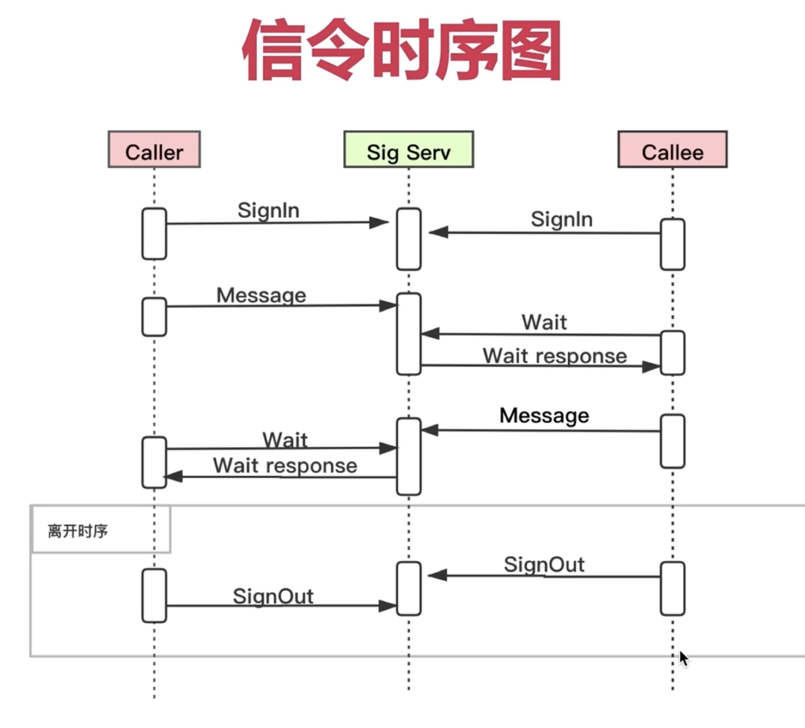

当第二章编译完成后，生成下面的文件。我们主要对peerconnection_client进行分析.
```
peerconnection_client：客户端程序
peerconnection_server:信令服务器
```


一对一的构架主要设计以下知识点：
- 音视频检测与采集
- peer connection的创建
- sdp的生成,offer/answer的交换
- nats穿越

## 程序的构架

- 程序分为三大块，绿色代表窗口相关，橙色与webrtc原生api相关，conductor相当于调度。
- conductor是核心类,通过他调用MainWin和peerconnection_client
- MainWind会调用MainWindCallback,conductor实现了这个接口
- peerconnectionClient会调用peerconnectionClientObserver，conductor实现了这个接口

## 程序的信令
- 信令都是主动发起的
- sigin,sigout：登录退出信令
- message:传递sdp,candidate，保存在peerconnection_server。
- wait: 拉取对端传递的message


## 媒体协商与完美协商
```
呼叫端：
createOffer() -> 
被呼叫端:
```