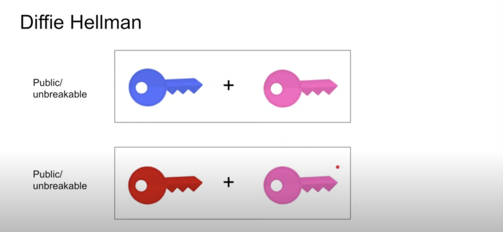

- Diffie-Hellman 是一个分解对称公钥的算法
- 公钥的算法= Pub+pri_1 + pri_2,Pub可以公开，而pri不可以。

- Pub+pri_1，pub+pri_2都要以公开
- 零 pub_client=Pub+pri_1,pub_server=Pub+pri_2
## TLS1.3
- 解决问题：即使服务器的rsa私钥泄露，也不会被解密 《对称公钥》。
- 抛弃了密钥交换，抛弃了rsa？（应该还有证书发送与验证过程）
- 简化的握手过程


- 1.客户端生成 pub,pri_1,计算  pub_client=Pub+pri_1,把(pub,pub_client)发生给服务器
- 2.1 服务器生成pri_2,结合pub_client 获得 对称公钥 K
- 2.2 服务器计算 pub_server=pub+pri_2,把pub_server发生给客户端
- 客户端 获得对称公钥 K（pub_server+pri_1）
- 双方使用K 来通信


```sh
#生成参数(prime,generator)
openssl genpkey -genparam -algorithm DH -pkeyopt dh_paramgen_prime_len:1024 -text
openssl genpkey -genparam -algorithm DH -pkeyopt dh_paramgen_prime_len:1024 -out  dhp.pem


#alex 使用参数 dhp.pem,生成 pub,pri
openssl genpkey -paramfile dhp.pem -out alex_key.pem
openssl pkey -in alex_key.pem -text   #查看
#提取出pub
openssl pkey -in  alex_key.pem -pubout -out  alex_pub.pem
openssl pkey  -in  alex_pub.pem -pubin -text #查看


#bob 执行相同的操作
openssl genpkey -paramfile dhp.pem -out bob_key.pem
openssl pkey -in bob_key.pem -text   #查看
#提取出pub
openssl pkey -in  bob_key.pem -pubout -out  bob_pub.pem
openssl pkey  -in  bob_pub.pem -pubin -text #查看


#参考 Diffile-Hellman算法，
# alex_key.pem文件:   算法描述 
# P,G         --->    pub           
# private-key --->    pri1
# public-key  --->    pub+pri1

# bob_key.pem文件:   算法描述 
# P,G         --->    pub           
# private-key --->    pri2
# public-key  --->    pub+pri2

# 我应该把 alex的 P,G,public-key给 bob,也就是 alex_pub.pem这个文件

# bob使用自己的key,alex的 pub，获得对称密钥
openssl pkeyutl -derive -inkey bob_key.pem -peerkey alex_pub.pem -out secret_bob.bin

#同理alex
openssl pkeyutl -derive -inkey alex_key.pem -peerkey bob_pub.pem -out secret_alex.bin

# 验证是否相同
diff secret_alex.bin secret_bob.bin
```
