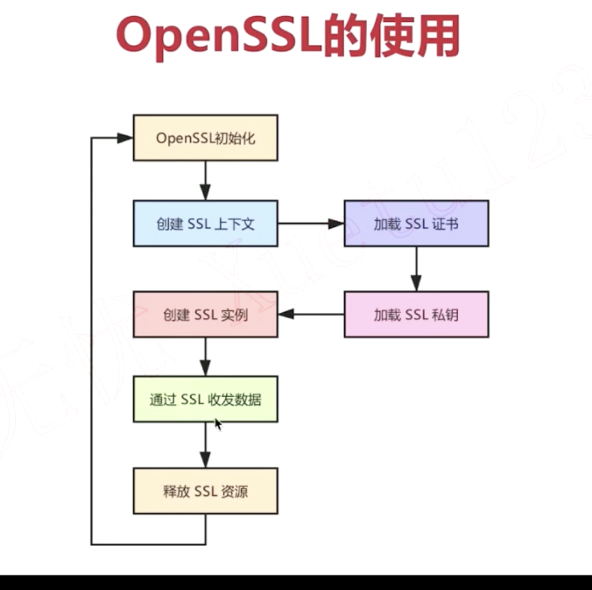
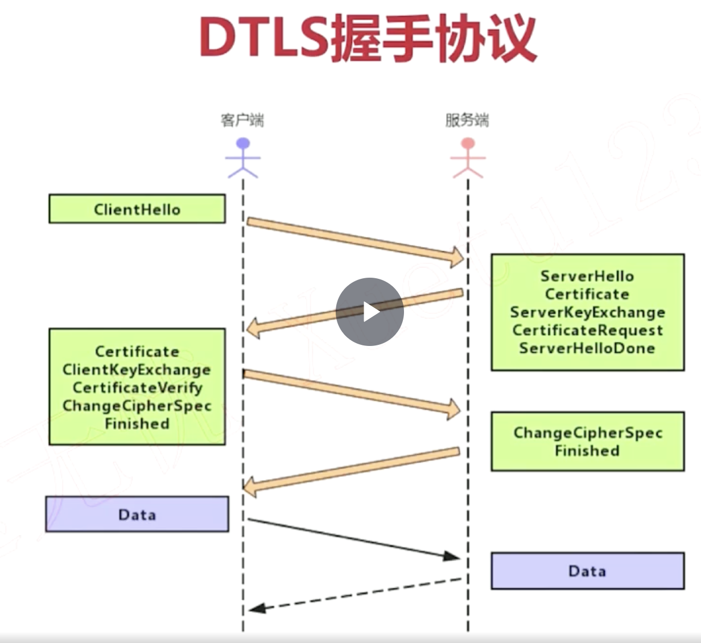
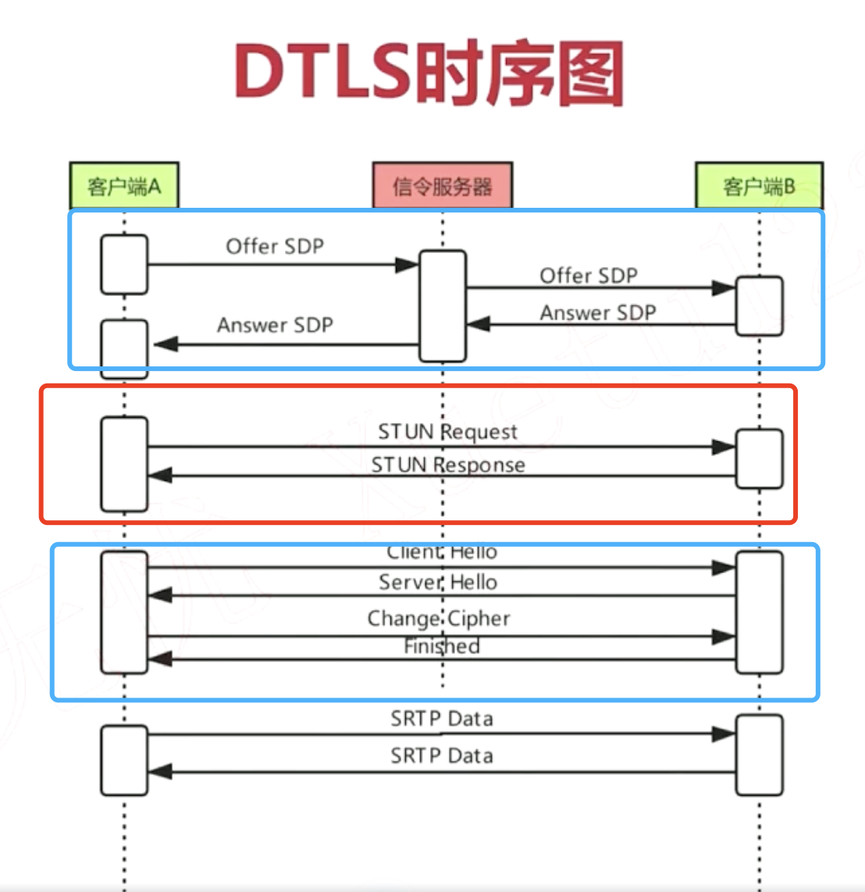
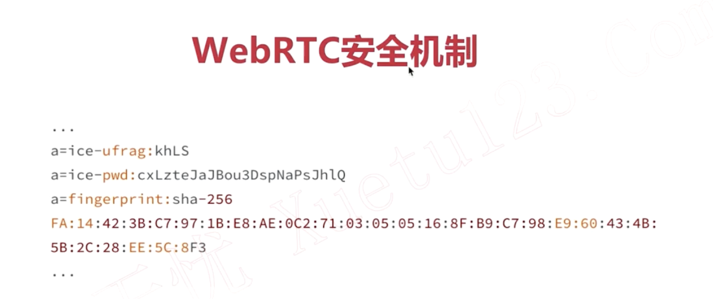
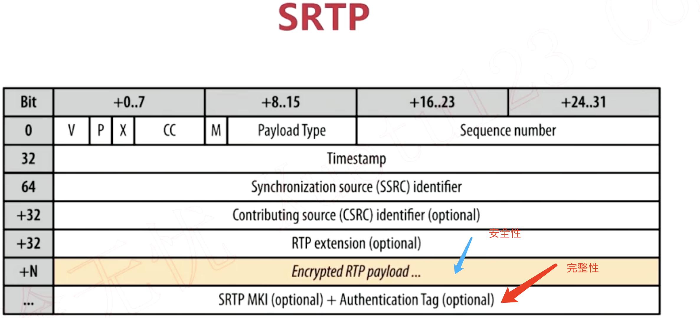

## 加密解码证书 
- 公钥，私钥
-  [RSA](http://www-cs-students.stanford.edu/~tjw/jsbn/rsa.html)
- 证书是证明 公钥，私钥是由本人发布的！！
### 生成私有证书
```sh
#方法1，来自k8s课程
openssl genrsa -out ca.key 2048  
openssl req -new -key ca.key  -out ca.csr
openssl x509 -req -in  ca.csr -days 365 -signkey ca.key -out ca.crt 
```

```sh
#方法2
openssl req -x509  -days 365  -newkey rsa:1024 -nodes -keyout ca.key -out ca.crt 
```

``` sh
#查看证书
openssl x509 -in ca.crt -text -noout
```

## TLS(>SSL3.0)协议
- 基于TCP协议的
- TLS握手协议，交换证书，算法套件。
- TLS记录协议，用握手交换的信息加密信息，并传输。
## OpenSSL原理
- 开源的ssl(security sockets layer)， 实现了TLS,DTLS
- SSL_CONTEXT： 保存【TLS握手协议】的信息
- SSL_instance，绑定socket,进行 【TLS记录协议】
- SSL_Write,SSL_Read



## DTLS握手协议
- 基于UDP协议的


- 客户端发起hello
- 服务端回复server hello,发送服务端证书，key,并要求客户端也发生他的证书。
- 客户端验证服务的的证书后，把他的证书，key发送给服务器，同时发送锁支持的【算法套件】。
- 服务端 协商【算法套件】，结果告诉客户端,我理解这里的【算法套件】是对称算法，如AES
## webrtc的 连接建立


- signal服务器交换sdp,收集对端candidate。
-  根据对端candidate,一端主动向对端发送 stun request,对端回复stun request。
- stun request就是一个 user/password的认证请求，认证的信息在 交换的sdp里面已经记录了.

- DTLS握手。


## DTLS-SRTP:
- DTLS 握手结束后，协商好了使用加密的 【对称算法】与【密钥】。
- SRTP对RTP的payload进行加密，保证数据的安全性。
- SRTP对RTP的payload+header进行摘要算法，保证数据的完整性.
- <font color=red>libsrtp库</font>

