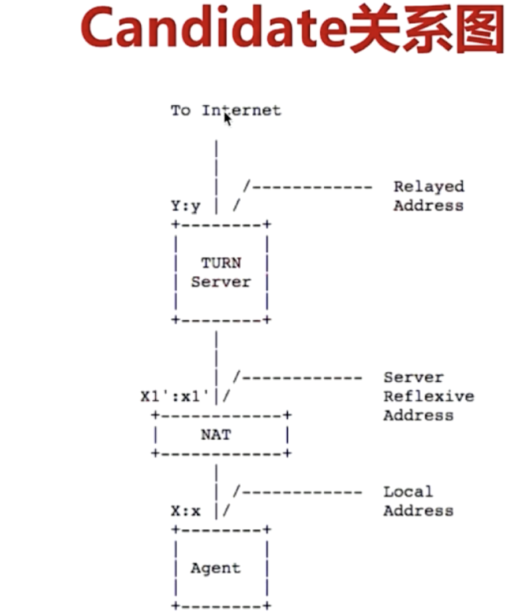

### 什么是ice?
通信的两端需要经过【交互】才可以通讯。

### candidate
- candidate简单的可以理解成为地址
- candidate格式：  协议： ip: port:类别
```yaml
a=candidate ...UDP 192.168.1.2 8722 type host
```
- Candidate类别：
- - 主机候选者：本机的所有ip与指定端口
- - 反射候选者:stun/turn
- - 中继候选者:turn

### ICE工作流程
- 收集candidate
- 交换candidate
- 对 candidate pair排序
- 测试连通性