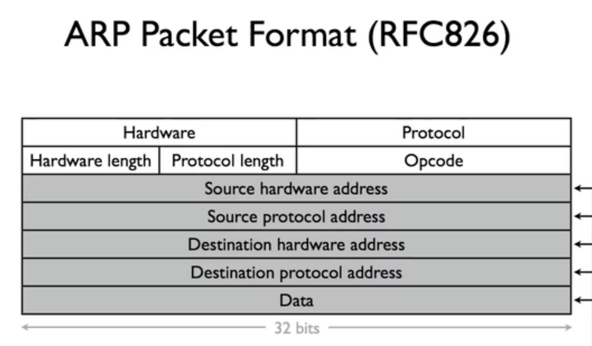

- ARP协议作为 获得mac与ip对应关系的请求/响应
- Hardware: Ethernet(1),Protocal:Internet protocol(0x0800)
- Hardware Length:6,Protocal Length:4
- Opcode: 1-请求，2-响应
- Destication hardward address: 请求的时候，填写0xffffffffffff,响应的时候填写mac地址