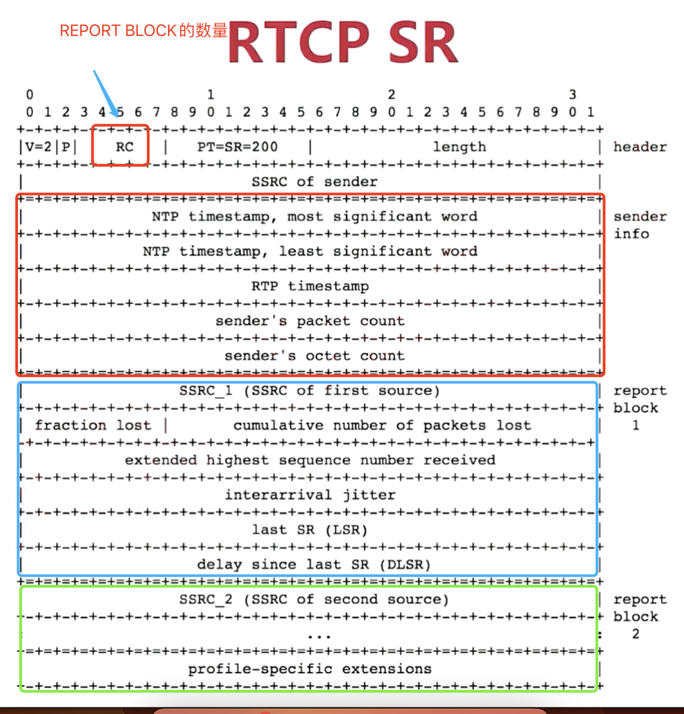
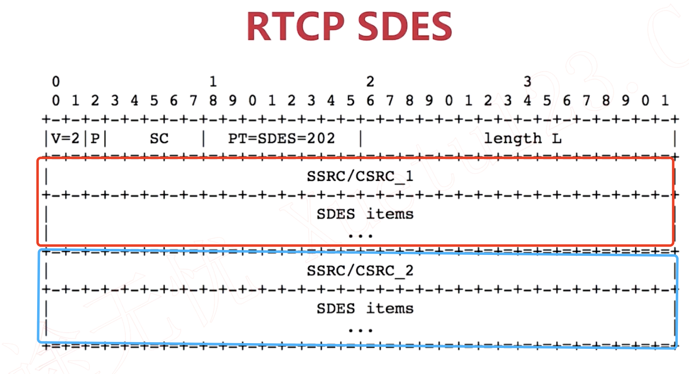
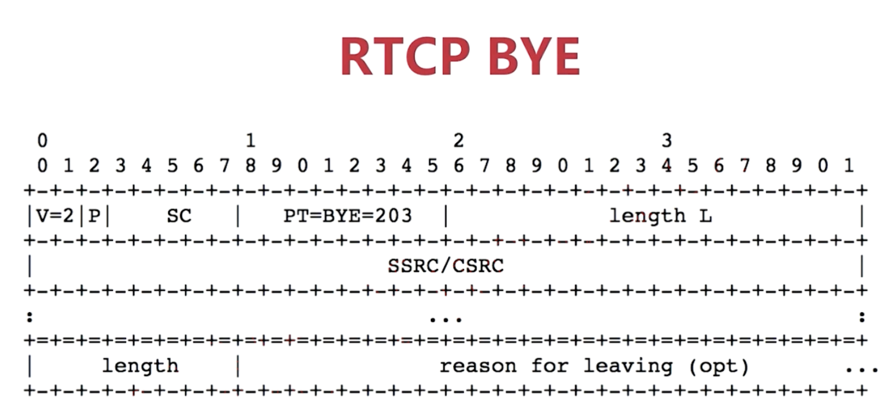
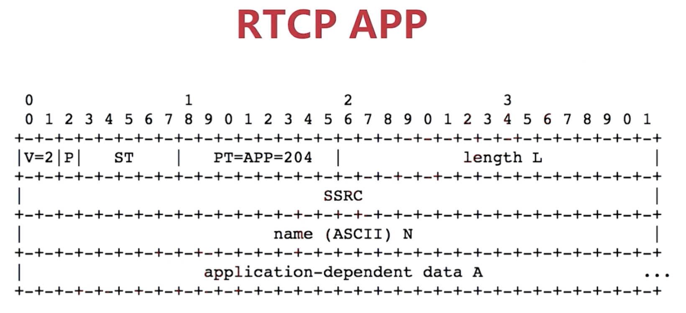
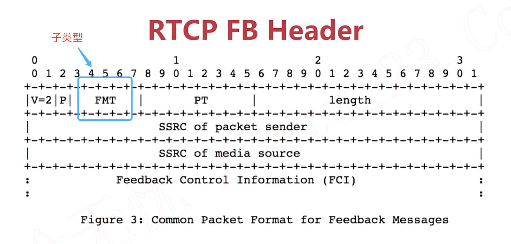

## RTCP
```
0                   1                   2                   3
0 1 2 3 4 5 6 7 8 9 0 1 2 3 4 5 6 7 8 9 0 1 2 3 4 5 6 7 8 9 0 1
+-+-+-+-+-+-+-+-+-+-+-+-+-+-+-+-+-+-+-+-+-+-+-+-+-+-+-+-+-+-+-+-+
|V=2|P|   RC    |  PT   |        length                         |
+-+-+-+-+-+-+-+-+-+-+-+-+-+-+-+-+-+-+-+-+-+-+-+-+-+-+-+-+-+-+-+-+

```

- V（Version）：2位，指示RTCP协议的版本。
- P（Padding）：1位，指示RTCP报文是否包含填充字节,报文末尾是填充字节数。
- RC（Report Count）：5位，指示RTCP报文中报告块的数量。
- PT（Packet Type）：8位，指示RTCP报文的类型，如SR、RR、SDES、BYE等。
- length（长度）：16位，指示RTCP报文的总长度，包括4字节的头部。


### Packet Type

|PT |标识| 全名| 备注|
|- | -  | -  |-   |
|200 | SR | Sender Report   | 带宽评估有关   |
|201 | RR | Receiver Report  |带宽评估有关   |
|202 | SDES | Source Description  |最重要的是cname   |
|203 | BYE | Goodbye  |   |
|204 | APP |  Application-defined packet |   |用户自定义反馈
|192 | FIR | Full INTRA-frame Request  | 废弃，请求IDR  |
|192 | NACK | Negative Acknowledgement. | 废弃，格式是Seq+mask，mask置1的地方表示没有收到的seq number  |
|205 | RTPFB | Generic RTP Feedback  |  用于传输RTP特定的反馈信息，如Generic NACK等。 |
|206 | PSFB | Payload-specific Feedback  | 用于传输负载特定的反馈信息，如NACK（Negative Acknowledgment）等。 |

### RTCP SR
-  应该是发送端 向接收端发送的报文
-  报文分为 sendinfo + report block[n]
-  RC字段 表示  report block的数量
-  RTCP Header中的SSRC of sender，可以告诉接受者是谁发的这个报文？？？


#### sender Info
- NTP: 64位，网络时间戳，用于不同源之间的同步
- RTP timestamp:32位，相于时间戳，与RTP包时间戳一致
- packet count: 发送者 发的数据包数量
- octet count:  发送者 发的数据包字节量

#### Receive Report Block
- fraction lost: 8位，上一次报告之后从SSRC_ n来包的丢包比例
- packets lost： 24位，自接收开始丢包总数，迟到包不算丢包，重传有可以导致负数
- hightest seq num：低16位表式收到的最大seq,高16位表式seq循环次数
- jitter: RTP包到达时间间隔的统计方差
- Last SR :NTP时间戳的中间32位
- Delay LSR :本次与上次发送SR的间隔
### RTCP RR
- 与SR一致，只是没有sendinfo

### RTCP SDES
- 对源（SSRC）的描述
- 头部SC字段表示 后面SSRC描述的个数。
- CNAME 是SSRC的规范名称，例如切换摄像头，SSRC会改变，但是CName不变。通过SDES消息，发送端通知接收端这一改变。
- SDES ITEM采用 TLV类型的存储。




### RTCP BYE
- 对某个或者多个ssrc结束传输
- 结束的原因

### RTCP APP
- ST :5位，应用自定义的在同一个名子下的子类型
- NAME:4字节，应用自定X的名子.


### RTCP FeedBack

RTCP Feedback的类型

|类型|说明|
|-|-|
|传输层FB(pt=205)|针对于网络传输的，例如是否丢包nack|
|负载层FB(pt=206)|针对印编解码的,如PLI|
|应用层FB|-|


#### RTCP  RTPFB(205)

- 子类型 NACK,fmt=1
- 子类型 TMMBR,fmt=3,请求流的最大bitrate
- 子类型 IMMBN,fmt=4,响应流的最大bitrate


#### RTCP PSFB(206)
子类型

- PLI: ,fmt=1，丢失图片
- SLI: ,fmt=2，丢失图片slice
- RPSI: ,fmt=3,丢失B帧
- FIR :  fmt=4,请求I帧
- TSTR:  fmt=5,Temporal-Spatial Trade-off Request
- TSTN:  fmt=6,Temporal-Spatial Trade-off Notification
