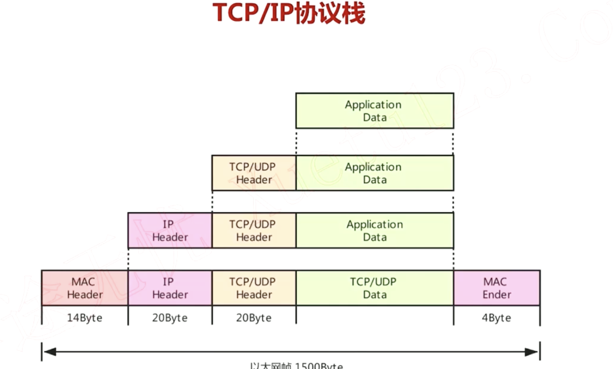
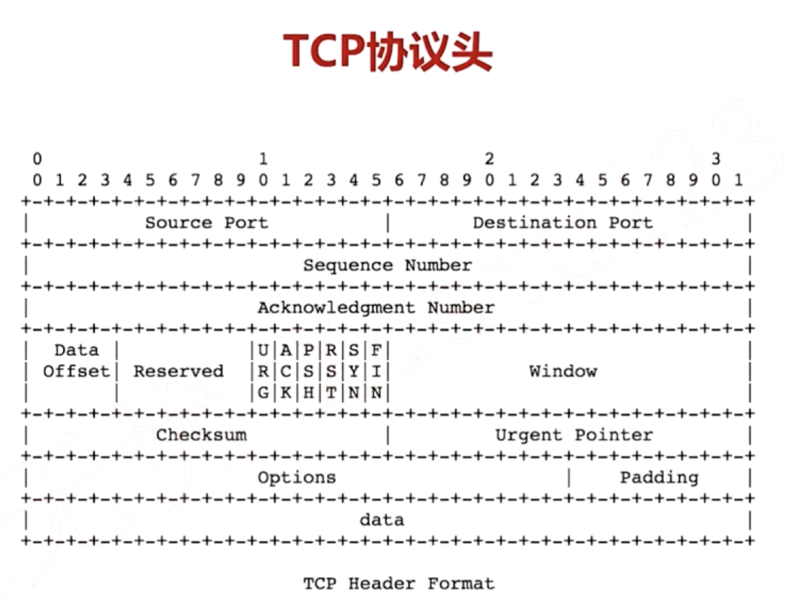
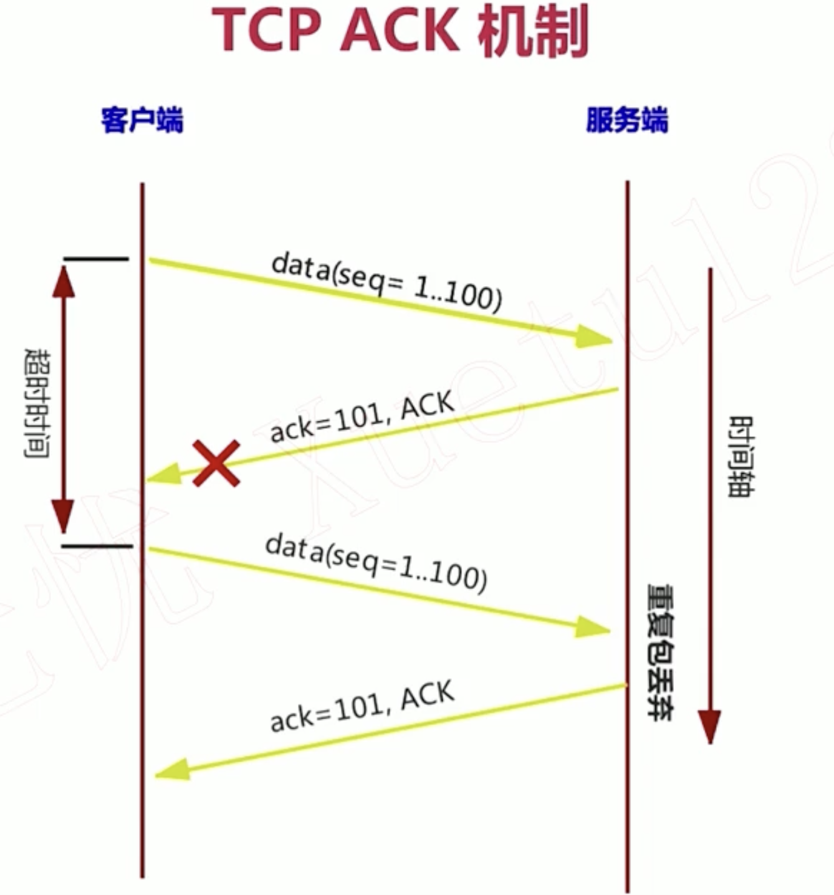
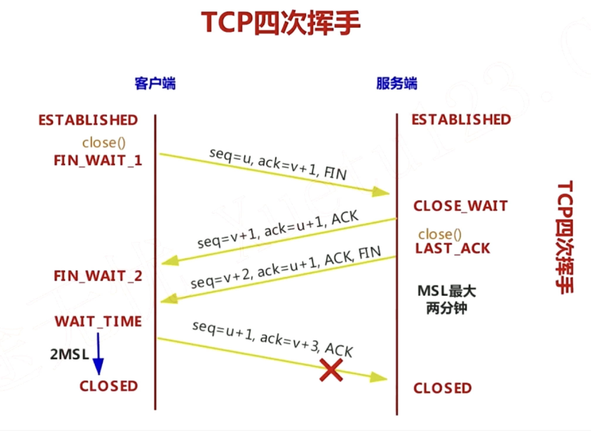
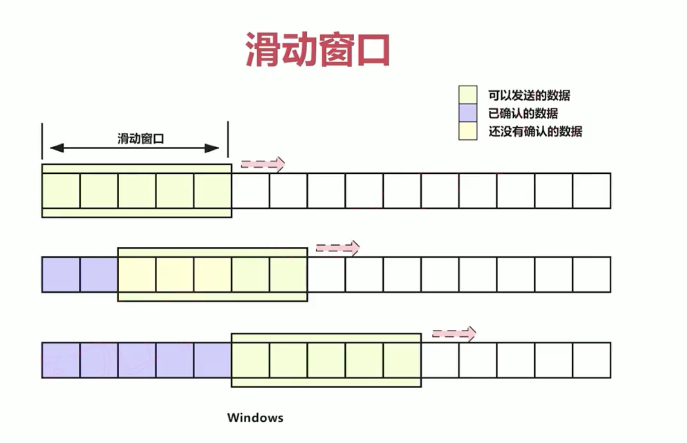
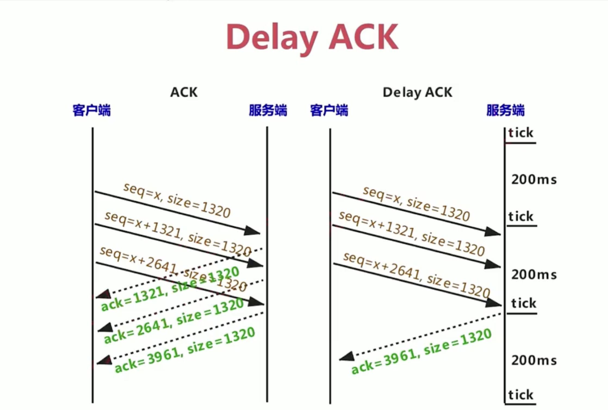

## 对TCP协议的再次理解

- TCP通讯从来都是双向的，发送端发生的数据(psh)，接收端要回复确认(ack)，如果2分钟收不到对应的ACK，发送端会重新发生。
- <font color=red>为了保证效率，发送端不需要发送一个 等待确认，再发送再等确认。。而是发送window个数据包，等待确认最后的一个ack，window是 开始协商的一个数值</font>
- Sequence Number是为了保证数据有序的， 第一次是随机的，之后的增长是按照 发字节数增长的。
```
    第一次 seq  1  长度 200
    第二次 seq  201  长度 300
    第三次 seq  501  长度 500
    第四次 seq  1001  长度 100
    。。。。等待回复ACK。。。。。
    #seq= seq + package size
```
- Ack Number：为了保证数据的可靠传输，接收端要回复发送端 以下 我希望下次收到的 seq。

```
    回复上面的发生，这里window设置是4
   Ack 1101
```
- <font color=pink>超时退避机制: 当同一个包多次发生超时不回复(没收到ack)，超时等待时间(RTO)会增加，这是假设网络可能很拥堵，需要等更多的时间考虑</font>。

## 重要字段解析

- DataOffset 表示 最下面data的偏移位置。
- PSH,ACK标志，分别对应 发送端，回复端的 TCP数据包
- RST: 发送端如果发送到一个没有打开的端口，回复端 回复RST=1，表示端口没打开
- SYN：三次握手
- FIN：四次挥手

## 三次握手

- 客户端 connect 在收到回复之前是阻塞的
- 服务端 accept  在收到回复之前是阻塞的
- 三次握手确认了： 双方的seq, 滑动窗口，报文最大长度(MSS)
## 四次挥手


- 图中主动发送close是客户端
- 主动发送close的 必然要经过WAIT_TIME，WAIT_TIME是关闭端的一个保护机制，保证第二次挥手的完成。
- <font color=red>如果服务器是主动关闭，那么服务器一定会等待 WAIT_TIME后才能使用端口，这也是为什么 要把服务器监听的socket设置reuse原因，不让等待WAIT_TIME，直接使用。</font>

## 滑动窗口与延迟回复

- 发送端有一个缓冲区，缓冲区在【滑动窗口的数据是要发送的】
- 发送出去的数据，如果没有收到ack，是待确认的，如果等待一定时间还没有ack,那就会重复发生
- 待确认收到ack后，会把【滑动窗口向前滑动】

-  回复端设置一个定时器，触发的时候才会回复.回复会后的报文即可。