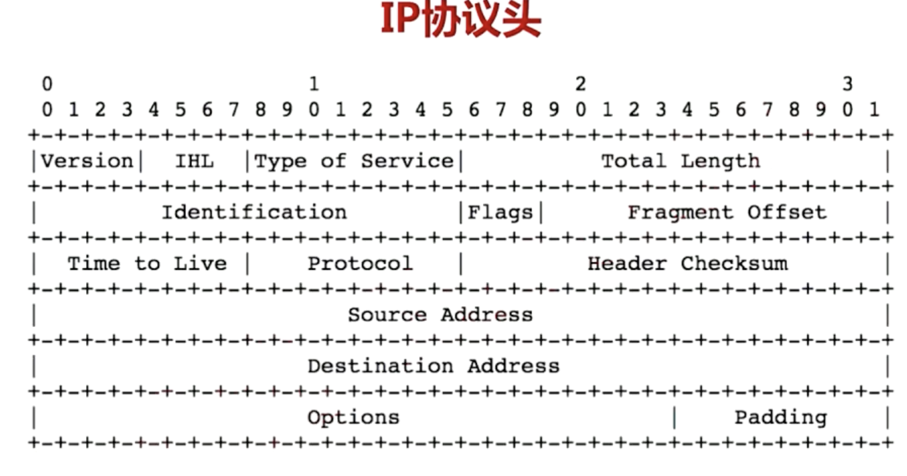

## IP数据包

- 第一行字段含义：VERSION,Header长度，服务类型，数据包总长度
- 第二行字段都与是否拆包有关。 
- - identificatin是包的唯一标识，相同标识的 ip包属于 一个完整的包
- - flags有 一个DF（dont fragment）用于不设置拆包，注意是大端模式
- - Fragmemt offset是 如果拆包，那么偏移是多少
- 第三行字段含义:
- - TTL： 经过的路由条数，没经过一个路由这个字段减一，0的时候被丢弃。
- - Protocal: 下层协议内型 ：UDP TCP
- - Checksum:ip header校验和,因为ttl每次经过路由都会变化所以这个数值也是变化的

## MTU

- 最大传输单元，由物理层决定,对于以太网是1500字节
- 通过ICMP可以查询MTU。把DF设置为1