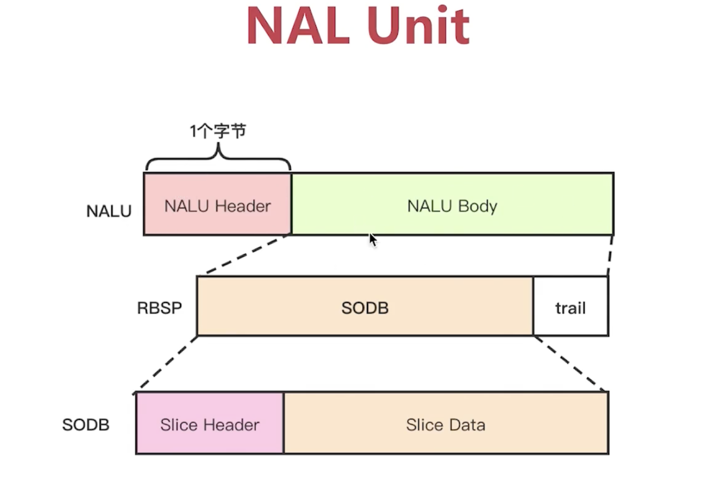

# H264码流 分层结构
- 总体结构是 H264=VCL层 + NAL层
- VCL的输出码流 叫SODB
- SODB的 对齐叫做 RBSP

上图中
- 如果使用RTP传输H265，RTP的payload就是 nalu
- 如果存成文件，则是Annexb格式，nalu前加入 [启始码00001],可能还由【封装】加入其他头部

# VCL:视频编码层，核心的算法层
    - 帧:N个片组成
    - 片(slice)：N个宏块组成
    - 宏块：16x16的YUV组成,h264编码的基本单元

宏快与slice的关系

- mb_type: 预测模式，1-9
- mb_pred: 预测值
- coded_residual: 残差
# NAL:网络抽取层
    - 可以理解为NAL是一个H264的最外层的壳
    - 片以上的语法级别（序列参数集(sps)，图像参数集合(pps)）,针对网络传输.

## NALU:络抽取层单元
    - Header:  1bits（forbid）+2bits(主要性指示)+5bits(NAL_UNIT_TYPE)
    - 对象重要的frame，如pps,sps,idr,主要性指示是11
    - RBSP(视频编码数据):片数据
    - NALU在rtp传输，是作为rtp的payload的的
    - 3的关键帧出现的顺序是 SPS PPS IDR

### NAL_UNIT_TYPE
| 类别  | Header | type |中文|
|-----|--------|------|------|
| IDR | 0x65   | 5    |I帧，关键帧|
| SPS | 0x67   | 7    |序列参数集|
| PPS | 0x68   | 8    |图像参数集合|
| SEI | 0x66   | 6    |视频序列解码的增强信心，不是很重要的参数|
