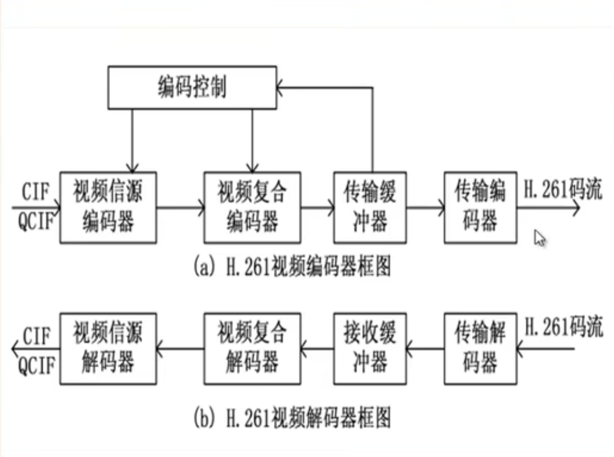
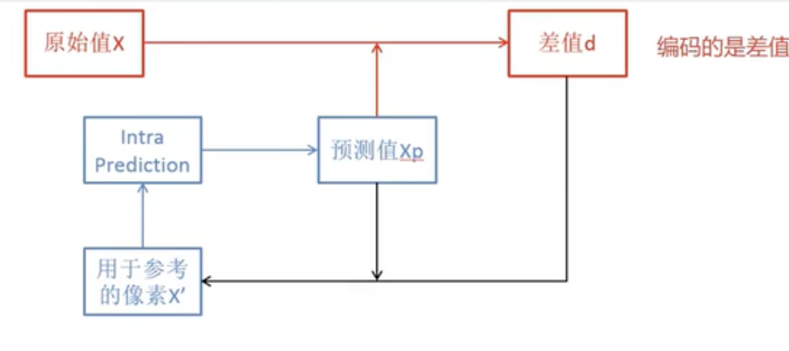
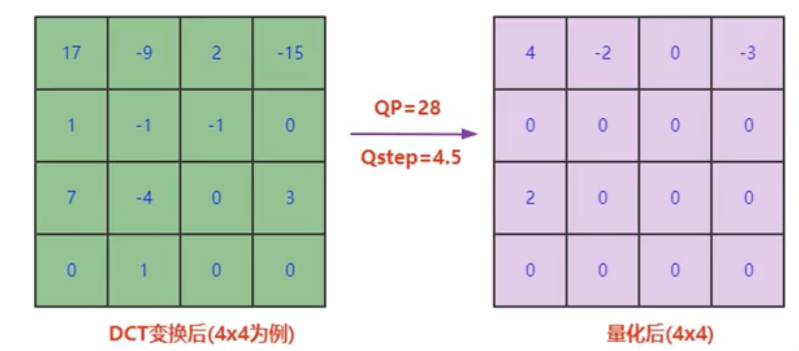
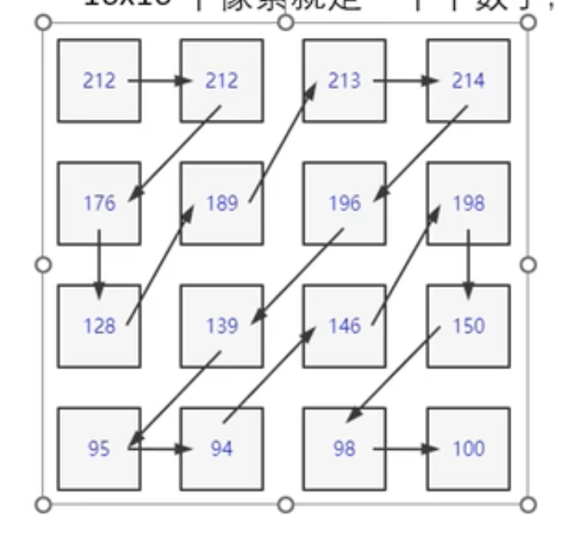

### 软解码与硬解码
DSP芯片：手机上的专用解码芯片，遵循google的规范。

FFMPEG:CPU
### H261编码器的流程

- CIF ：一个完整的帧
- 视频信源编码器： 把CIP进行块编码
- 视频复合器： 合成音频和视频
- 传输缓冲器： 缓冲存放 待输出的图片与音频
- 传输编码器： 格式化输出H261码流


### [帧内压缩](https://www.zzsin.com/article/pred.html)

-  X'这个参考 指的是宏块的最左边和最上边的像素
- Intra Prediction:有9中模式，使用残差最小的那种
- - <font color=red>对于亮度块，分16x16和4x4的预测模式，后期加入了8x8的预测模式。16x16是粗颗粒预测，4x4是细颗粒预测，H264在编码的时候结合两者</font>
- 原值与预测值的差 就是残差
- 残差会经过DCT ,DCT后再经过量化，量化后在 无损编码

```sh

#九种预测模式简图
# https://www.zzsin.com/article/pred.html

#竖直预测模式
M A B C D E F G H
I A B C D
J A B C D
K A B C D
L A B C D

#水平预测模式
M A B C D E F G H
I I I I I
J J J J J
K K K K K
L L L L L

#diagnal down-left 模式
M A B C D E F G H
I B C D E F G H
J C D E F G H
K D E F G H
L E F G H

M A B C D E F G H
I M A B C
J I M A B
K J I M A
L K J I M

#vertical-right 模式
M A B C D E F G H
I M A B C
J M A B C
K K M A B
L K M A B

# horizontal-down 模式
M A B C D E F G H
I M M B B
J I I M M
K J J I I
L L L J J

# vertical-left 模式
M A B C D E F G H
I B C D E F
J B C D E F
K C D E F
L C D E F

#horizontal-up 模式
M A B C D E F G H
I I I J J
J J J K K
K K K L L
L L L

# DC模式
M A B C D E F G H
I
J
K
L
```
### 量化


- QP表示量化等级，越低质量约好，越高生成的码率越小
- Qstep是由QP 确定的,这里是 除法？
### 无损编码

- 使用这种方法，把宏块数据 变成字节序列，进行熵编码