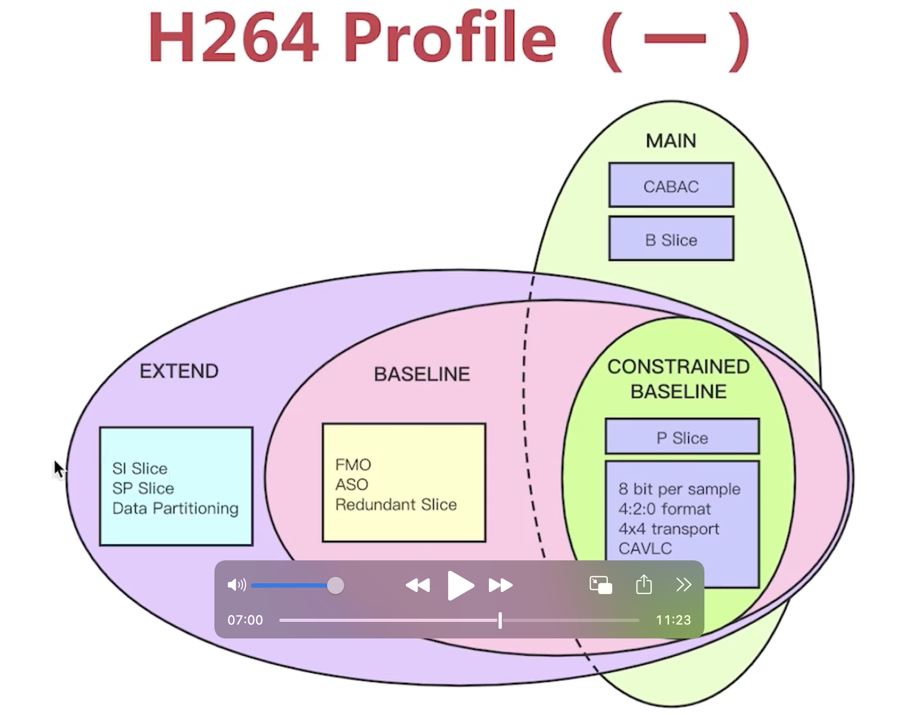
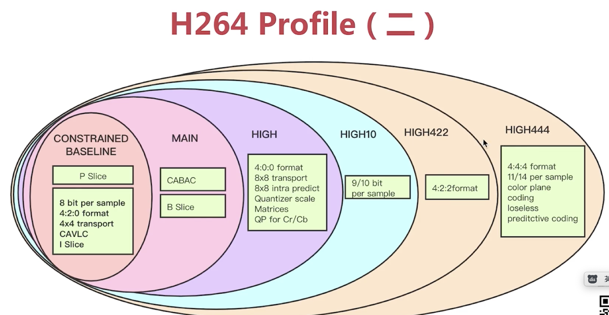
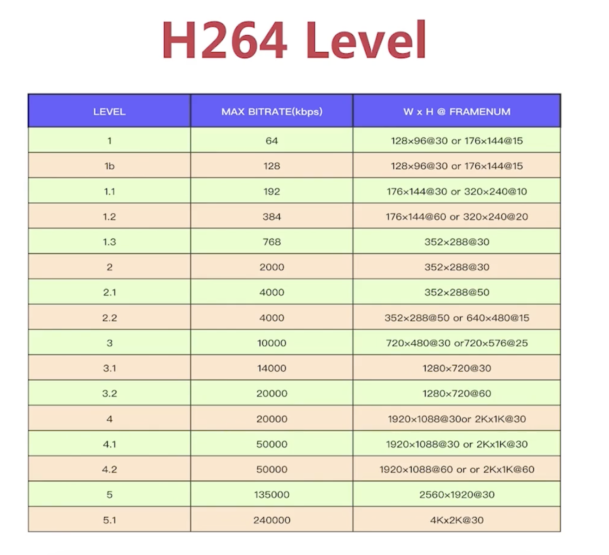
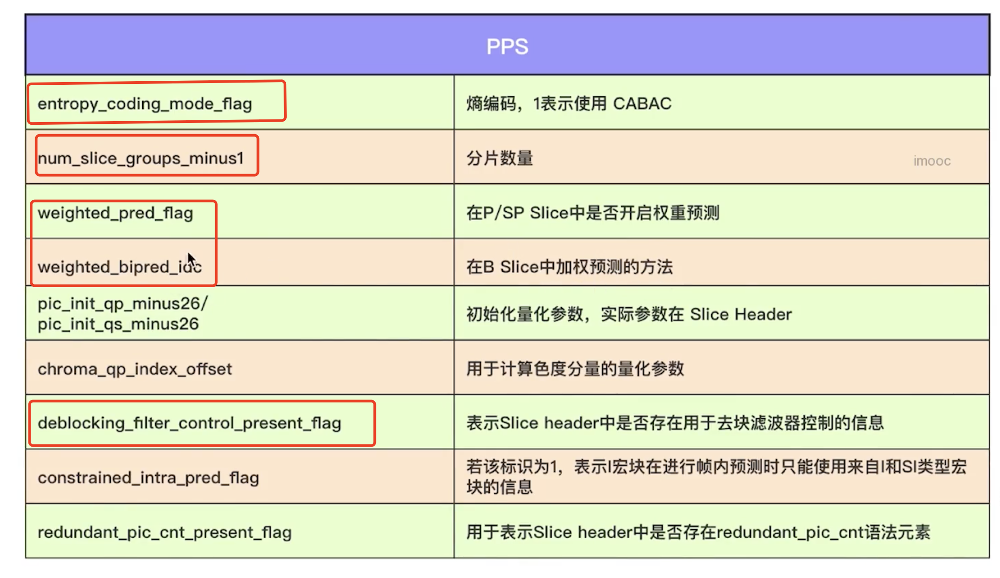

# profiie
profile是对压缩特性，压缩能力的描述。
- 在constrained baseline的基础之上，有两个分支，main和extend,我们常用main这个分支。
- main 与 constrained baseline区别是 支持B帧和 使用无损压缩CABAC.
- h264是对yuv数据编码
- 高级的profile主要体现的特性有： 支持更多YU格式,支持更高的采样位数，支持多种宏块大小定义。



# level

level是你对你要编码，解码的视频的描述，只有level级别设置的和你的视频匹配，h264编码器才会工作。


# SPS

从Sps中能获得以下信息：
- profile:
```
profile_idc: 表示当前 H.264 码流的编码档次。其中部分档次：
基础档次：BaselineProfile (profile_idc 值为 66)
主要档次：MainProfile (profile_idc 值为 77)
扩展档次：ExtentedProfile (profile_idc 值为 88)
```
- Level:???
```
level_idc，表示当前码流的编码等级。编码的等级定义了某种条件下的最大视频分辨率、最大视频帧率等参数。
```
- seq_parameter_set_id:sps的id
- 视频相关


|视频相关属性|||
|-|-|-|
|pic_width_in_mbs_minus1|图像宽度包含的宏块个数-1|
|pic_heigh_in_mbs_minus1|图像高度包含的宏块个数-1|
|frame_mbs_only_flag|帧编码还是场编码（场是隔行扫描，产生两张图）|
|frame_cropping_flag|图像是否需要裁剪|
|frame_crop_left_offset|减去左侧的偏移量
|frame_crop_right_offset|减去右侧的偏移量
|frame_crop_bottom_offset|减去底部的偏移量
|frame_crop_top_offset|减去顶部的偏移量

- 帧相关

- - 帧最大序号数 C=log2_max frame num_minus4，GOP中最大帧数=$2^C+4$，frame_num的最大需要，**frame_num是在sliceHeader中，是解码后帧的序号**。
- - 参考帧数 max num ref frames，有多少个参考帧,参考帧缓存队列的消息
- - 显示帧序号 pic_order_ cnt type：显示顺序的类型，觉得如何显示.解码后的帧要计算他的pts.**这个pic_order_ cnt type就是决定如何计算pts的**
- 帧率

```C
framerate = (float) (sps-> vui.vui_time_scale) /
(float)(sps->vui.vui_num_units_in_tick) / 2;
```

# PPS


- pic_parameter_set_id，表示当前 PPS 的 id，相关联的各片通过这个 id 来引用对应的 PPS 参数。
- seq_parameter_set_id，表示当前 PPS 引用的 SPS 的 id。

- pps总得来说是定义了 后面slice header是否有XXX的信息，是否使用XXX的元素语法
# Slice Header
- frame_num :GOP中解码的序号
- pic_parameter_set_id: 表示这个slice关联到那个pps
- slice_type: I,B,P
- 预测权重信息
- 滤波信息


# libx264详细参数
从以下几块理解【# libx264参数】

- 预设数： 已经设置好的一组集合，针对与某类应用场景
- - 例如： preset fast/slow
- - tune 与图片质量有关。 
- 帧相关
- - keyint/min-keyint: keyint是GOP，min-keyint表示I帧最小可以的间隔,当发生场景切换的时候，只要间隔min-keyint，就要插入一个I帧。 这2个参数可以理解为 GOP和min-GOP.
- - scenecut: 场景切换的阈值，>scenecut=80%算场景切换
- - bframes： 连续最大B帧的数量
- - ref: 最大参考帧数量，也就是参考帧缓冲区大小.
- - no-deblock/deblock: deblock是使用【去块滤波器】，no-deblock表示不使用【去块滤波器】.
- - no-cabac: 不使用cabac
- 码流控制
- - bitrates:
- - 量化器Qp,Qmax(默认51),Qmin(10),Qsteps(4)， Qp可以理解成是个动态量，Qmin<=Qp<=Qmax,每次变化幅度是Qsteps。Qq关注量化器质量，**与bitrates互斥**
- - crf(默认23): 关注质量，越小约好。 **相同crf与Qp,Qp产生的码率会更大**
- 编码分析:
- - 宏块划分:p8x8,i4x4，。。。。
- - 运动评估算法的设置： 六边形，砖石。。。
- 输出
- - SAR: 输出宽高比
- - fps:
- - level: 


```sh
ffmpeg -vsync 1 -async 1 \
    - i xxx.flv \
    -b:v 200k - maxrate 250k -bufsize 400k \
    -pix_fmt yuv420p  \
    -vcodec libx264 -coder 1 \
    - refs 3 -bf 5 \
    -flags +loop-deblock -1:-1 \
    -partitions i4×4+ i8x8+ p8x8+ b8×8 \
    -me_method umh \
    -g 60 keyint_min 30 \
    -qmin 0 -qmax 69 -qdiff 2
    out.mp4
#-vsync 1 -async 1 表示音视频同步
# -b:v 200k - maxrate 250k 输出码率与最大码率
# -coder 1 熵编码使用cabac
# - refs 3 -bf 5 参考帧=3，最大连续B帧=5
#  -flags +loop-deblock -1:-1  使用【去块滤波器】及其参数
#  -me_method umh 运动评估算法
#  -g*60 keyint_min 30 GOP=60，Min-GOP=30
# -qmin 0 -qmax 69 -qdiff 2  量化器配置
```
[ffmpeg与libx264参数关系](https://sites.google.com/site/linuxencoding/x264-ffmpeg-mapping)
