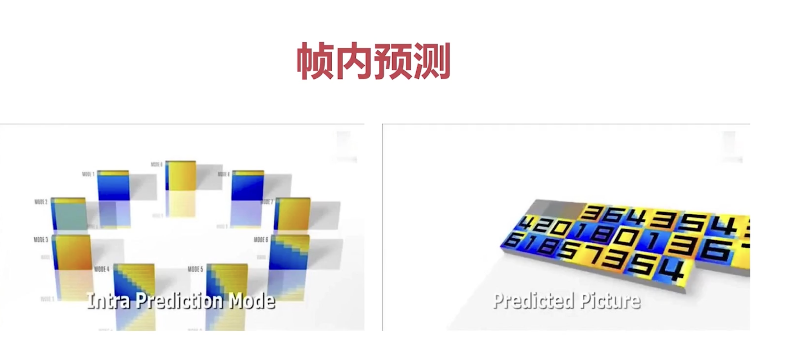
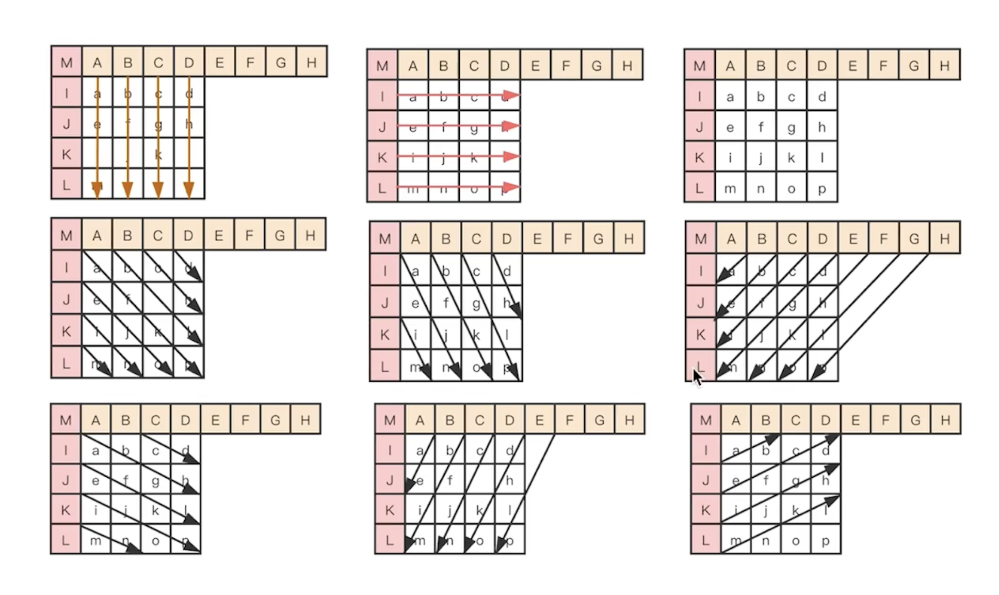
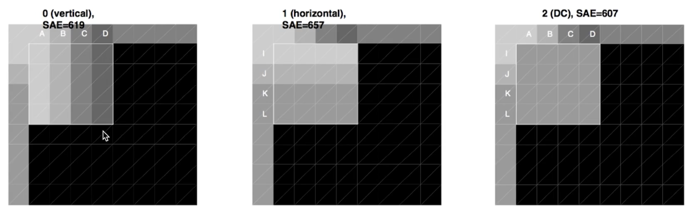
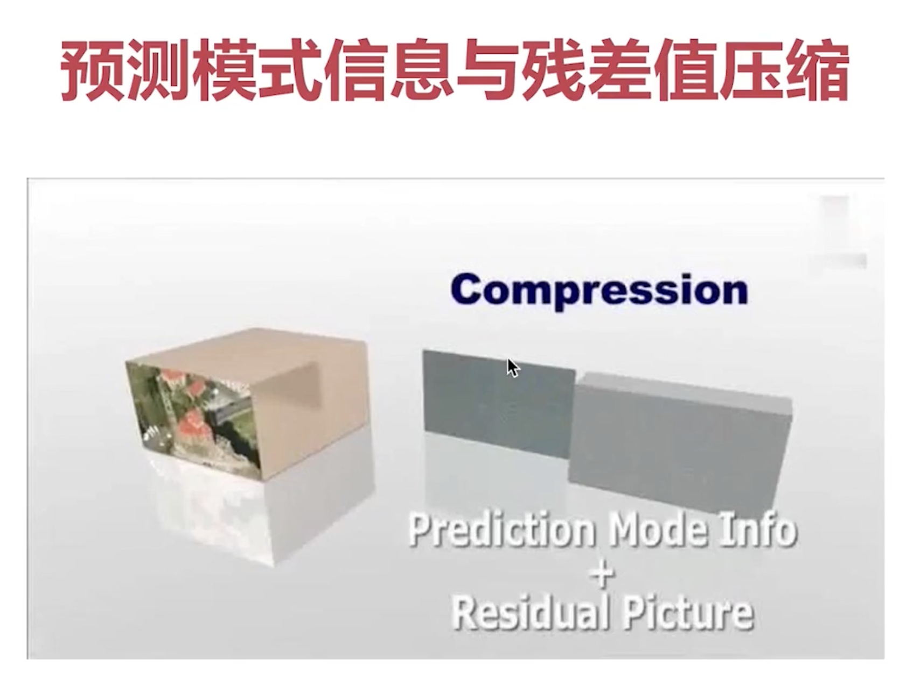
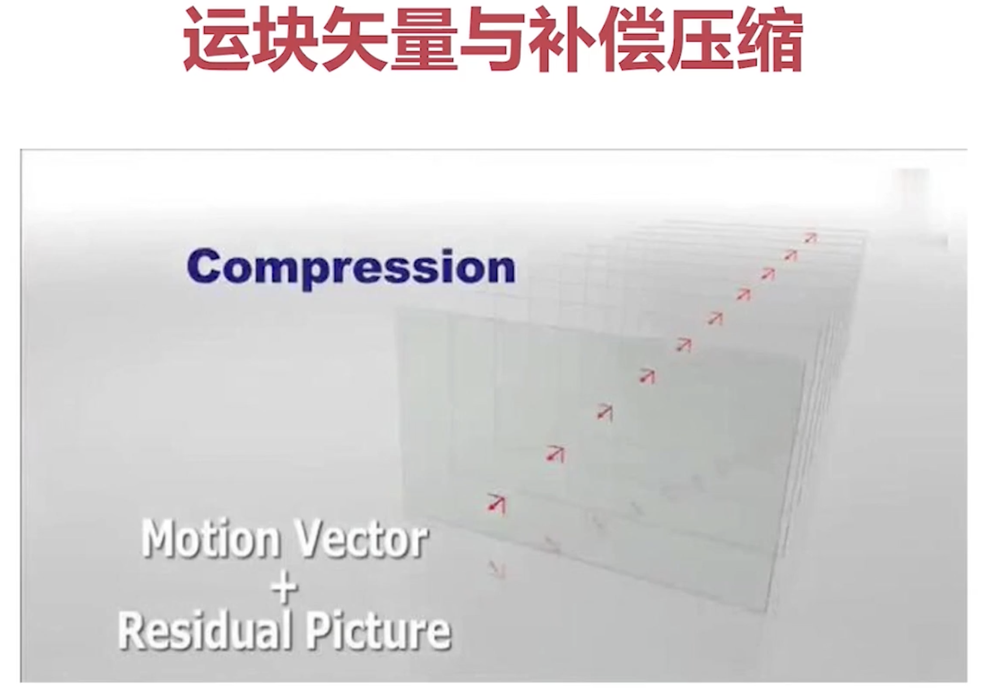
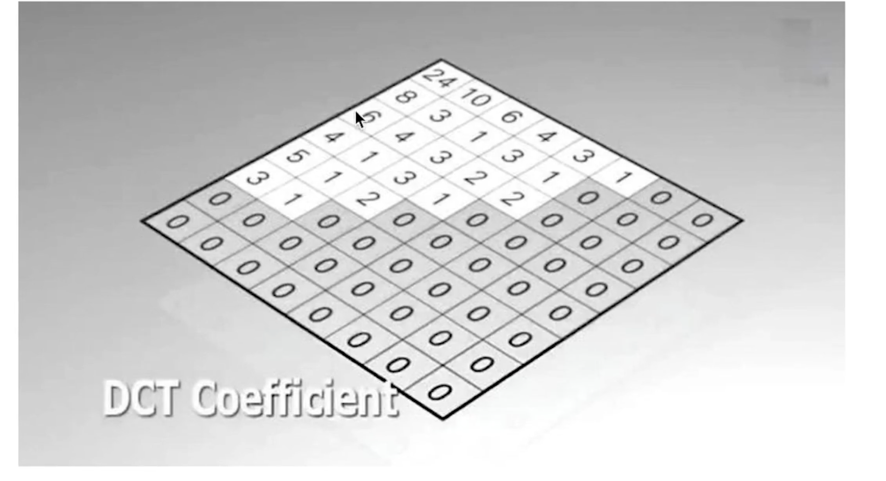
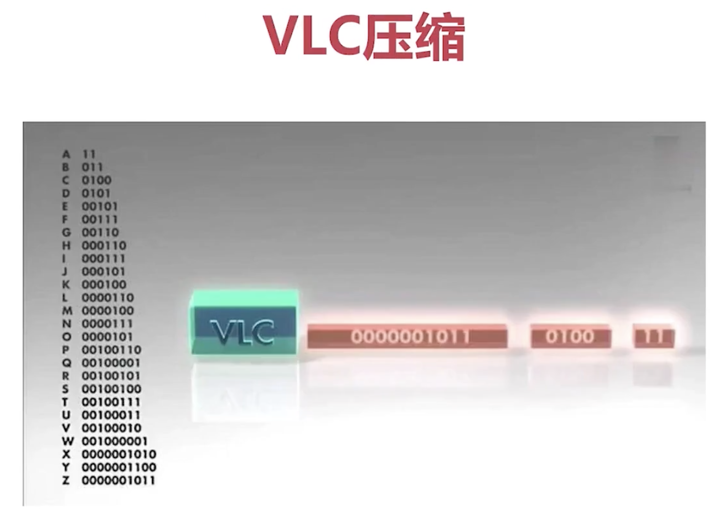
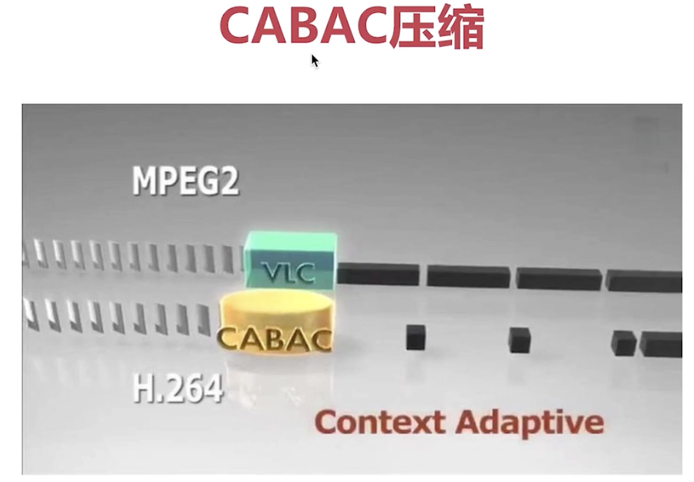

## H264采用的压缩技术集合
- 帧内压缩
- 帧间压缩
- DCT： time domain -> freq domain，无损,频域上调整完成再量化
- CABAC压缩： 无损,上下文数据压缩,熵编码技术。

## 帧内压缩理论基础

- 亮度(Y)与色度(UV)分开进行。
- 从一个【已知宏块】参考的出发，预测周边未知宏块有【9种预测模式】，压缩过程中每个宏由压缩算法快速选择其中一种模式，这种模式【还原的宏】块与【原宏块】最为接近。
- 根据【选择的模式】，可以还原完成全部宏块，得到预测Predict，与原图做差值得到 【残差residual】
- 帧内压缩是对 【所有的宏块预测模式】+【残差residual】的压缩。
- 还原的图片= predict + residual

## 帧间压缩理论基础
- 在一个GOP内，相邻的帧进行压缩的技术
- 【参考帧】，后面的P帧基于参考帧比较
- 运动估计， 【要被预测的宏块】 使用【宏块查找】，在【参考帧】中找到与他最匹配的【参考帧宏块】，计算出【运动矢量】。
-  计算 匹配的【参考帧宏块】 与【要被预测的宏块】的残差作为【运动补偿】
- 帧间压缩是对 所有的宏块 【运动矢量】+【运动补偿】的压缩。
- 还原的图片= 用【运动矢量】定位【参考帧的宏块】 + 【运动补偿】

## 无损压缩的流程

-经过有损压缩完成输出的数据 要进入无损压缩环境
- 使用[DCT]变换，在频域内，把数据分布做了集中，只需要对集中的数据进行压缩。
- 使用【滳编码】算法，对DCT的输出进行无损编码
- 常用的【滳编码】,VCL->mpeg2，CABAC->h264
- [H264 profile](https://en.wikipedia.org/wiki/Advanced_Video_Coding#Feature_support_in_particular_profiles)与 [H264实现参考](https://en.wikipedia.org/wiki/Advanced_Video_Coding#Software_encoders)
- 最终结果加上【NALU】头部，封装成为码流。

