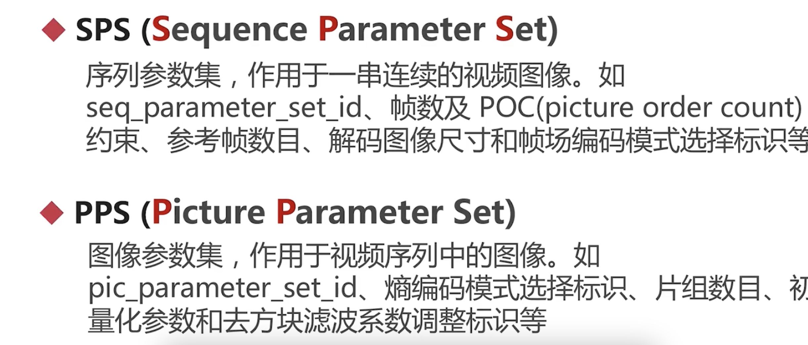

### H264压缩比，建议码率

- 压缩比:1/100
- [压缩比](https://docportal.shengwang.cn/cn/video-call-4.x/video_profile_android_ng?platform=Android)

### GOP

强相关的视频帧被分成一组，便于压缩处理。

### I B P

- I: 关键帧
- P：向前参考帧，I/2，帧间压缩
- B: 双向参考帧 ，I/4，帧间压缩**B帧注意不会参考B帧**
- 时事通讯不会有B,而转码大量使用B帧。
- IDR:GOP的首帧，必须是I帧。 也叫 编码器立即刷新帧， 编码器收到这个帧，会立即情况编码缓冲区。
- SPS,PPS： 出现在IDR帧头部。sps与编码序列有关，PPS与编码图片有关。

### 宏块

- 压缩算法操作的基本单元
- 可以理解成像素块， 比如16x16的YUV块
- 【宏块】可以进一步划分为【子宏块】
-  宏块被划分的越小，压缩率也越高，但响应从计算量也增长。
####  宏块的尺寸
16x16,16x8,8x16,8x8,8x4,4x8,4x5

###  H264采用的压缩技术集合
- 帧内压缩
- 帧间压缩
- DCT： time domain -> freq domain，无损,频域上调整完成再量化
- CABAC压缩： 无损,上下文数据压缩
