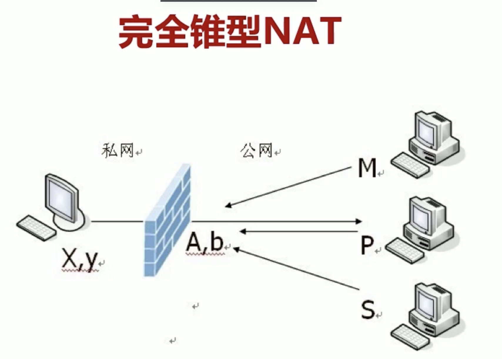
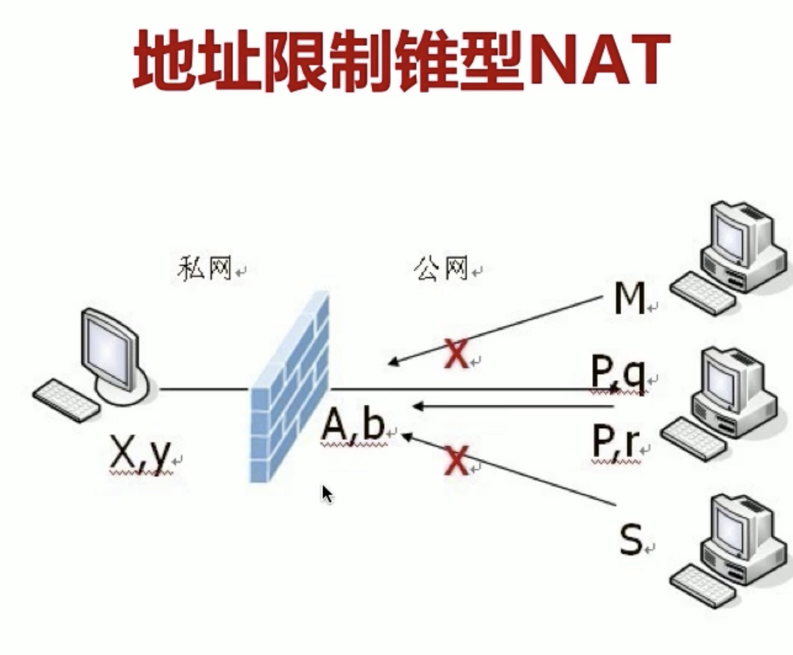
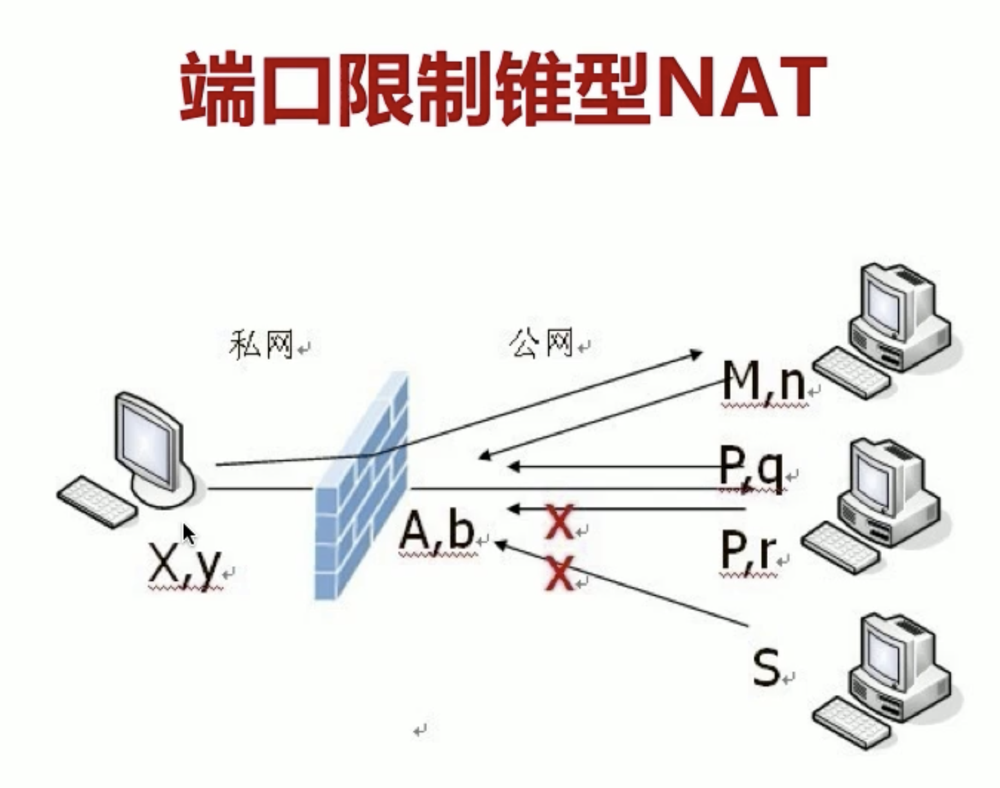
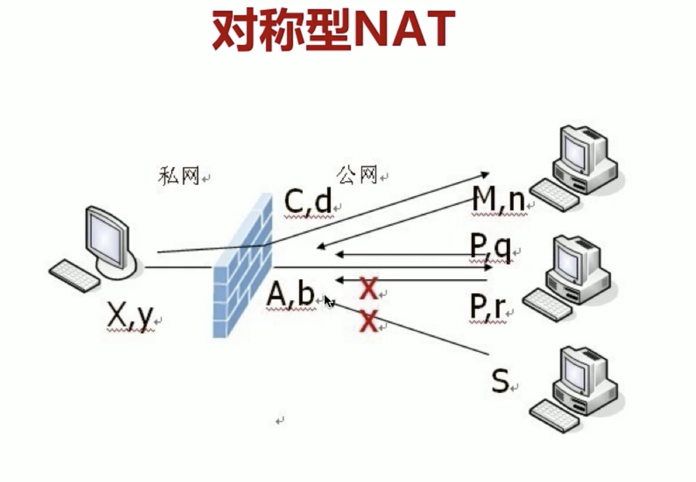

# 对称限制NAT

|源IP|源port | 出网Ip| 出网port| 目的IP|目的port | 
|-|-|-|-|-|-|
|X|y|C|d|M|n|
|X|y|A|b|P|q|

对称性不能打通的原因是：

内网主机通过中间STUN服务获得了自己的 出网（A,b）和对端的出网(P,q),向对端(P,q)发送请求，
但是 在NATS防火墙上的  出网变成的（C，d）,所以来自对端 (P,q)=>(A,b)的数据包不会被NAT
接受。

# nat穿越
- 通过stun协议，获得 自己的出网（A,a）与对端的出网(B, b)。
- 两端同时发起向对端的请求.（A,a）=>(B,b) ,(B,b) =>（A,a）
- 如果【两端都是 对称】的或者 【一个是对称另外一个是端口寿险】，以上打洞服务不会成功。