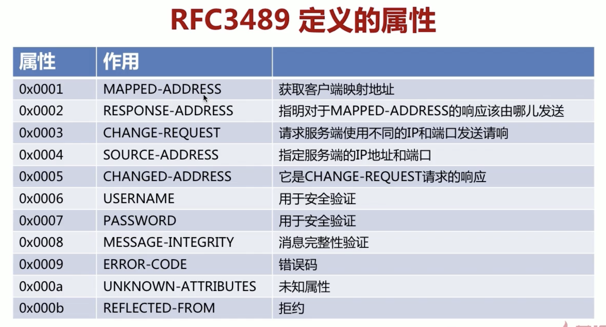
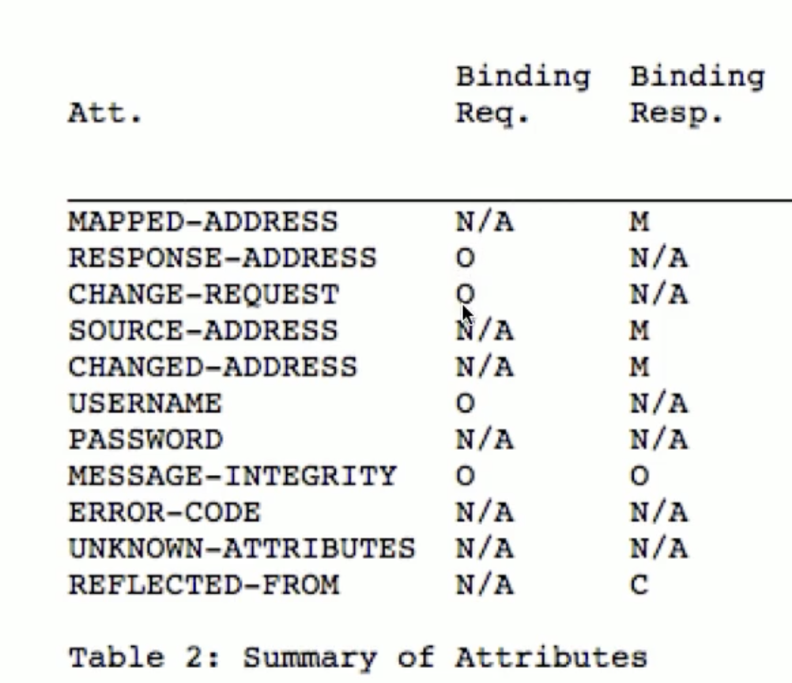

## RFC STUN规范
存在以下2个规范
- RFC3489: Simple traversal of udp throught nat:通过UDP进行穿越
- RFC5389(新): Seeion traversal unilities for nats：加入了TCP的穿越
- ICE的建立依赖stun协议
- <font color=red>在流媒体服务器中，stun主要用于 用户的身份合法性.</font>
## RFC5389 Header: 
```
 0                   1                   2                   3
 0 1 2 3 4 5 6 7 8 9 0 1 2 3 4 5 6 7 8 9 0 1 2 3 4 5 6 7 8 9 0 1
+-+-+-+-+-+-+-+-+-+-+-+-+-+-+-+-+-+-+-+-+-+-+-+-+-+-+-+-+-+-+-+-+
|0 0|     STUN Message Type     |         Message Length        |
+-+-+-+-+-+-+-+-+-+-+-+-+-+-+-+-+-+-+-+-+-+-+-+-+-+-+-+-+-+-+-+-+
|                         Magic Cookie                          |
+-+-+-+-+-+-+-+-+-+-+-+-+-+-+-+-+-+-+-+-+-+-+-+-+-+-+-+-+-+-+-+-+
|                                                               |
|                     Transaction ID (96 bits)                  |
|                                                               |
+-+-+-+-+-+-+-+-+-+-+-+-+-+-+-+-+-+-+-+-+-+-+-+-+-+-+-+-+-+-+-+-+
|                             Data                              |
+-+-+-+-+-+-+-+-+-+-+-+-+-+-+-+-+-+-+-+-+-+-+-+-+-+-+-+-+-+-+-+-+


STUN Message Type的后16位：

0 0 M11 M10   M9 M8 M7 C1   M6 M5 M4 C0   M3 M2 M1 M0
```


- 一共20个字节， type(2)+ length(2) +transaction(16) 
- Data中有0 个或者多个 atrr。
- STUN Message Type    
- - Binding Request - 0x0001,对应c0=0,c1=0
- - Binding Response - 0x0101,对应c0=0,c1=1
- - Binding Response Error   - 0x0111,对应c0=1,c1=1
-  Message Length  :这就是 Data 段的长度。
-  Magic Cookie ：固定0x2112A442
- Transaction ID:事务ID,用于匹配请求与响应。

## RFC3489 Data:
- TVL格式
- 支持一个或者多个属性 
```
0                   1                   2                   3
 0 1 2 3 4 5 6 7 8 9 0 1 2 3 4 5 6 7 8 9 0 1 2 3 4 5 6 7 8 9 0 1
+-+-+-+-+-+-+-+-+-+-+-+-+-+-+-+-+-+-+-+-+-+-+-+-+-+-+-+-+-+-+-+-+
|         Type                  |            Length             |
+-+-+-+-+-+-+-+-+-+-+-+-+-+-+-+-+-+-+-+-+-+-+-+-+-+-+-+-+-+-+-+-+
|                         Value (variable)                ....
+-+-+-+-+-+-+-+-+-+-+-+-+-+-+-+-+-+-+-+-+-+-+-+-+-+-+-+-+-+-+-+-+
```



- M是必须的，O是可选的