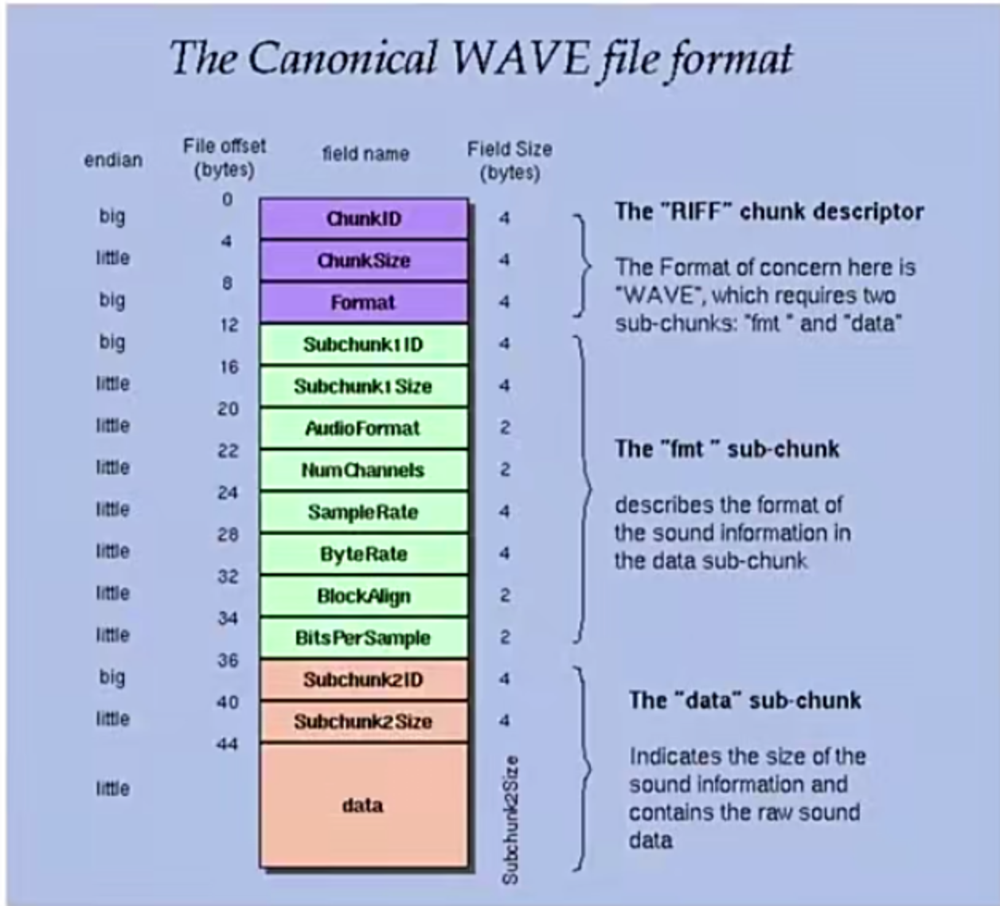
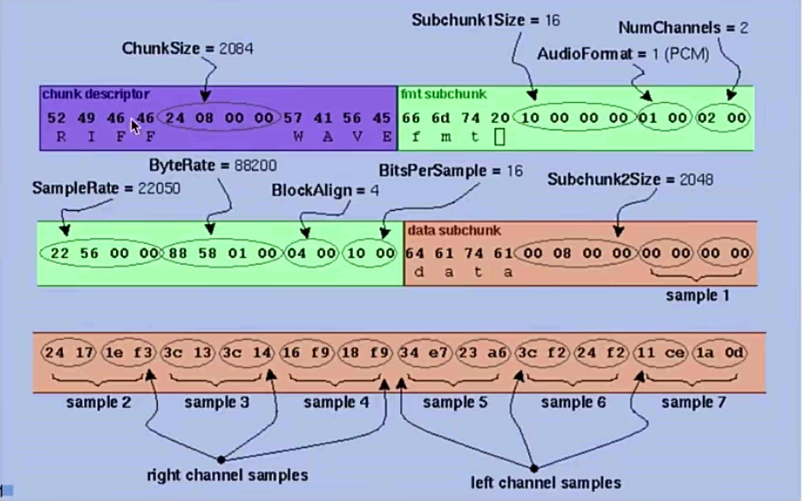

## 模拟信号量化成数字信号

**采样率**：每秒采集多少个样本点，常用的有48K,44.1K，还有32K，16K，8K。

**采用的过程**
- 模拟信号 按照采样率采集，量化后生成10进制浮点数。
```
11.3 22.4 88.3 12.2 ...
```
- 10进制浮点数缩放，近似成为10进制整数。
```
113 224 883 122 ...
```
- 十进制转2进制,形成二进制方波。

## 采样大小（位深）

位深决定了数字信号的 取值范围。

|位数||表示范围|
|-|-|-:|
|8位|无符号|0~255|
|8位|有符号|-128~127|
|16位|无符号|-32768~32767|
|16位|有符号|0~65535|

## 音频原始格式

- PCM 裸数据
- WAV格式 PCM数据的封装

## 音频量化的参数

- 采样率： 44.1K,48K,每秒采集多少次
- 采样大小(位深): 16bits,8bits,一次采集的数据量
- 声道：单声道，双声道，多声道，类似于人的耳朵，左右耳听到的略有不同
- **采集PCM的码率=采样率 x 采样大小 x 声道**

## Wav文件头
如前面所说，wav是对原始数据的封装，Wav封装也很简单，只有一个头部。



# 紫色部分

- 0-3字节   RIFF字符串
- 4-7字节   表示整个大小
- 8-11字节     一般是WAVE字符串


绿色部分
- 12-15字节 fmt字符串，表示对格式的描述
- AudioFormat: 1表示PCM
- 重点是 NUM_CHANNEL SAMPLERate  BitsOerSample
- 阅读的时候要注意看 是big 还是little endian.
橙色部分
- 12-15字节 data字符串

