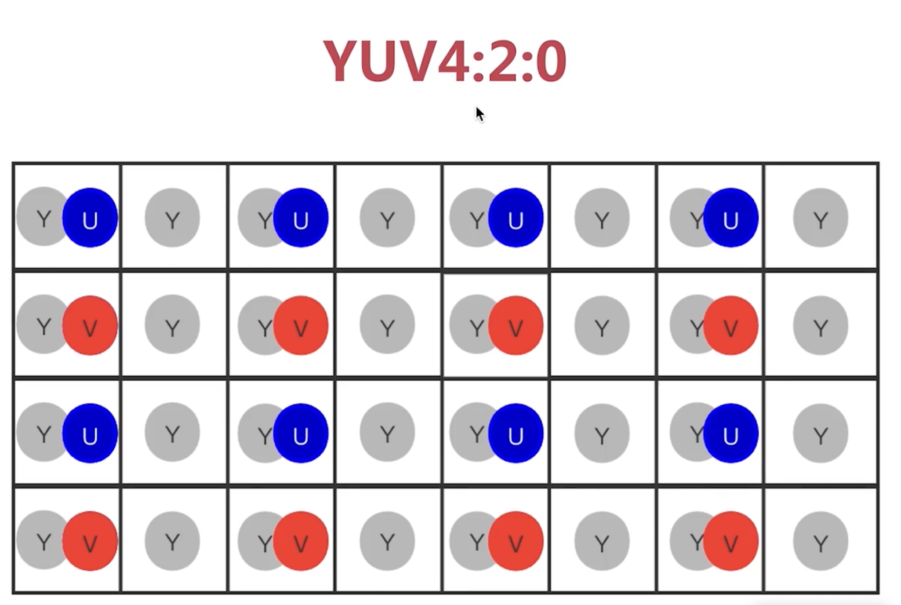

## 图片格式

- RGB888
- RGBA
- BGR:用于位图BMP格式

## 显示器
- ppi:每英寸 像素数
- dpi:每英寸 点数
- ppi>300 视网膜级别

## RGB码率的计算
$$Bits/S= Fps *分辨率*3*8$$
### 分辨率
- 16:9,4:3
- 360p,720p,1k,2k都是 16:9的模式下的分辨率。640x360,1280x720...


## YUV420格式

YUV分别代表Y,Cr,Cb三个份量。Cr,Cb是色度分量。对于一行扫描线，只有Y,Cr或者Y,Cb按照4:2的比例采样。所以Cr,Cb是Y的1/4.

$$YUV420=Y*1.5=RGB/2$$

- 早期电视的色彩标准
- 还有YUV444,YUV422标准格式
- Y-亮度，Cr 红色分量,Cb 蓝色分量。




### YUV420码率
$$Bits/S= Fps *分辨率*1.5*8$$

### YUV420存储格式

- 分层结构，Y在最前面，这样黑白就可以读取全部的亮度信息，忽略后面的Cr,Cb
- UV的存储分为平面(planner) 与打包(packet)


```
planner:YUV420P

I420  YYYYYYYY UUVV
YV12  YYYYYYYY VVUU
```

```
packet:YUV420SP，UV交叉存储

NV12 YYYYYYYY UVUV
NV21 YYYYYYYY VUVU
```
- I420最为常见
- YV12是mac使用的格式
- NV21是android使用的格式
