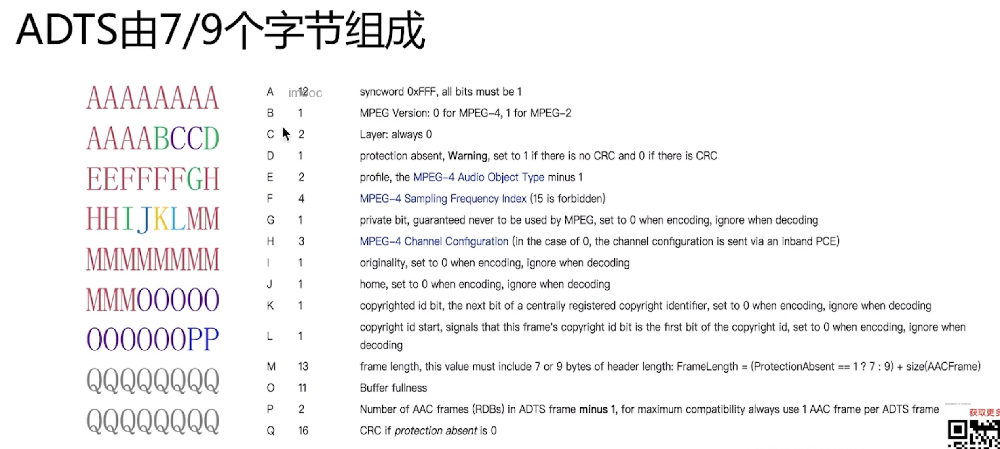

## [结构表](https://www.p23.nl/projects/aac-header/)

## Audio Object Types

|数值||规格|
|-|-|-|
|1||aac main|
|2||aac lc|
|5||sbr aac HE|
|29||ps aac HEV2|

## sampling_frequency_index

|数值||规格|
|-|-|-|
|3||48K|
|4||44.1K|
|7||22.05k|
|11||8k|

## 声道配置
MPEG-4音频编码中的通道配置是指将不同的声道（或者音频信号）分配给特定的通道位置，以便在播放时正确呈现立体声、环绕声等音频效果。通道配置通常以一个数字序列来表示，每个数字对应于一个特定的声道。在MPEG-4中，通道配置信息被称为“Channel Configuration”。

MPEG-4的Channel Configuration采用了一种用于表示音频通道排列的紧凑形式，这种形式被称为"Audio Object Types"。这些对象类型定义了不同的声道布局和编码方法。以下是一些常见的音频对象类型和它们对应的通道配置：

单声道（单通道）：通常用于单声道音频。

Audio Object Type: 1
Channel Configuration: 1
立体声（双通道）：通常用于普通的立体声音频。

Audio Object Type: 2
Channel Configuration: 2
立体声加中央声道（2.1声道）：包括左右声道和一个中央声道，常用于影片和视频游戏音效。

Audio Object Type: 6
Channel Configuration: 3
立体声加环绕声（4.1声道）：除左右声道和中央声道外，还包括一个低频效果（LFE）声道和一个环绕声道。

Audio Object Type: 7
Channel Configuration: 5
多声道（5.1声道）：包括左、中、右声道，左右环绕声道，以及一个LFE声道，用于家庭影院系统。

Audio Object Type: 8
Channel Configuration: 6
需要注意的是，这些通道配置仅表示声道的数量和类型，而不涉及特定的音频编码方法。在实际的音频编码过程中，通常会结合具体的编码器和压缩算法来实现所需的通道配置。

请注意，虽然我提供的信息基于我截至2021年的知识，但MPEG标准可能已经有了更新。如有必要，请查阅最新的MPEG标准文档以获取更准确和最新的信息。


## c代码实现
```c
void adts_header(char *szAdtsHeader, int dataLen){
//.channel_config改成 1后可以正常播放，
//请理解这两个参数的含义！
    int audio_object_type = 2; //表示AAC LC
    int sampling_frequency_index = 3;//48K采样率
    int channel_config = 1;//单声道

    int adtsLen = dataLen + 7;

    szAdtsHeader[0] = 0xff;         //syncword:0xfff                          高8bits
    szAdtsHeader[1] = 0xf0;         //syncword:0xfff                          低4bits
    szAdtsHeader[1] |= (0 << 3);    //MPEG Version:0 for MPEG-4,1 for MPEG-2  1bit
    szAdtsHeader[1] |= (0 << 1);    //Layer:0                                 2bits
    szAdtsHeader[1] |= 1;           //protection absent:1                     1bit

    szAdtsHeader[2] = (audio_object_type - 1)<<6;            //profile:audio_object_type - 1                      2bits
    szAdtsHeader[2] |= (sampling_frequency_index & 0x0f)<<2; //sampling frequency index:sampling_frequency_index  4bits
    szAdtsHeader[2] |= (0 << 1);                             //private bit:0                                      1bit
    szAdtsHeader[2] |= (channel_config & 0x04)>>2;           //channel configuration:channel_config               高1bit

    szAdtsHeader[3] = (channel_config & 0x03)<<6;     //channel configuration:channel_config      低2bits
    szAdtsHeader[3] |= (0 << 5);                      //original：0                               1bit
    szAdtsHeader[3] |= (0 << 4);                      //home：0                                   1bit
    szAdtsHeader[3] |= (0 << 3);                      //copyright id bit：0                       1bit
    szAdtsHeader[3] |= (0 << 2);                      //copyright id start：0                     1bit
    szAdtsHeader[3] |= ((adtsLen & 0x1800) >> 11);           //frame length：value   高2bits

    szAdtsHeader[4] = (uint8_t)((adtsLen & 0x7f8) >> 3);     //frame length:value    中间8bits
    szAdtsHeader[5] = (uint8_t)((adtsLen & 0x7) << 5);       //frame length:value    低3bits
    szAdtsHeader[5] |= 0x1f;                                 //buffer fullness:0x7ff 高5bits
    szAdtsHeader[6] = 0xfc;
}
```