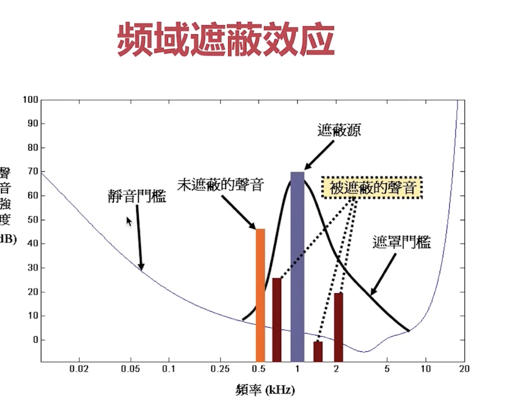
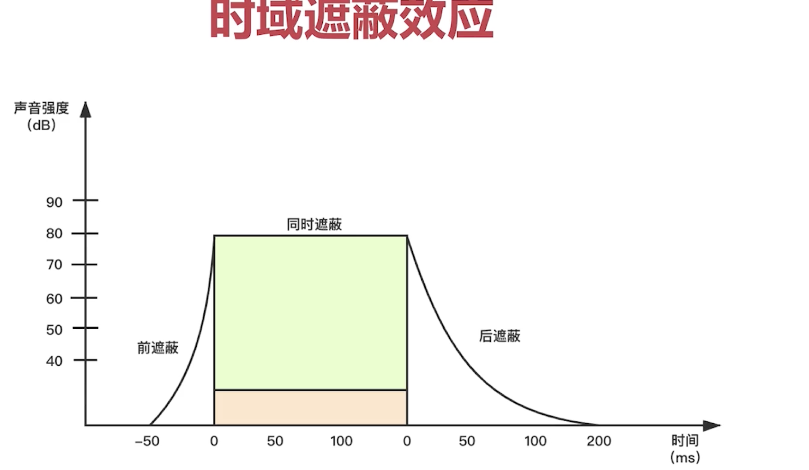
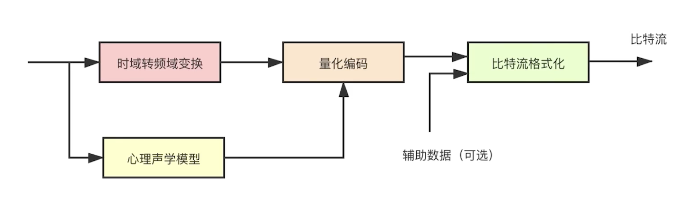
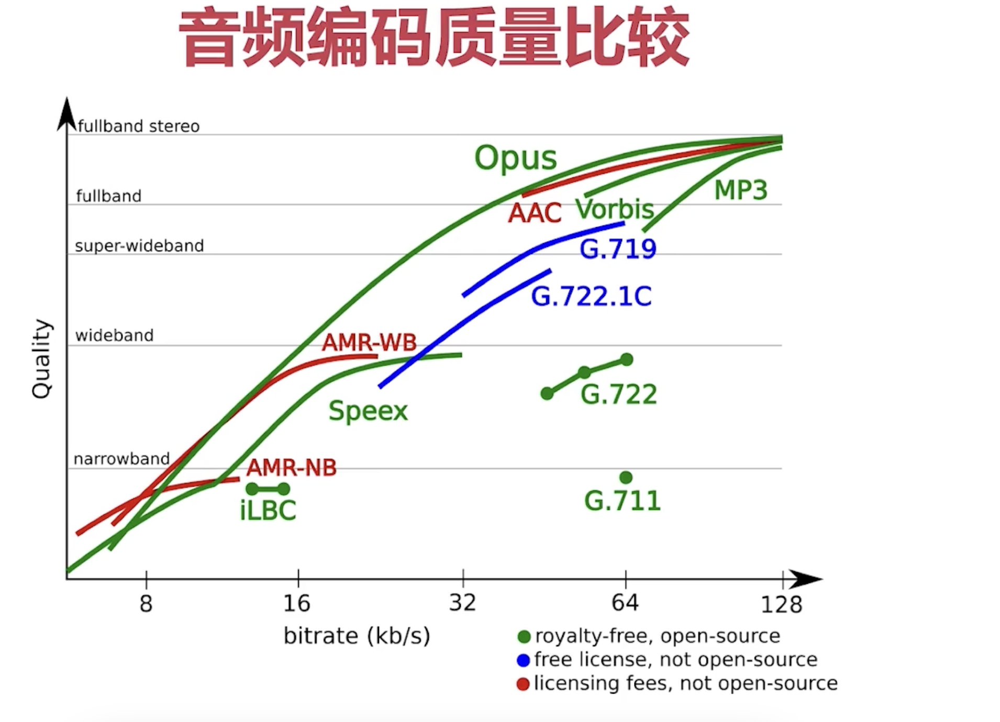

## 有损压缩

### 频域遮蔽效应

- 可听声波意外的可丢弃
- 幅度过小的可丢弃
- 相近频率的【音源】，大幅度的【音源】遮蔽小服务的【音源】。

### 时域遮蔽效应
- 幅度过小的可丢弃
- 幅度大的对 前后的比他小【音源】的有遮蔽效应。

## 无损压缩
有损压缩输出的基础上，进一步缩小文件体积，如zip,gzip,7zip

## 滳编码

- 哈夫曼编码
- 算数编码
- 香农编码

## 音频编码流程

- 量化编码的输出是【相对输入】是有损的
- 比特流输出【相对输入】是无损的
## 各种编码器比较

opus>aac>ogg

|名字|||
|-|-|-|
|mp3||逐渐被aac取代|
|aac||直播系统，成熟，占有率高|
|opus||实时交互,webrtc|
|speex||早期留下，回声消除|
|ogg||收费|
|G711||电话网络，窄带传输|

